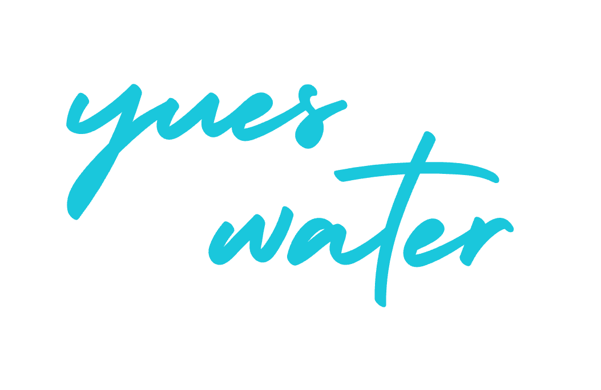

```{=html}
<script src="/assets/scripts/node_modules/typeit/dist/index.umd.js"></script>
```
<link rel="me" href="https://vis.social/@basepair" /> <link rel="me" href="https://genomic.social/@basepair" />

::: grid
::: {.g-col-12 .g-col-md-10 .g-start-md-2}
{fig-align="center" width=35%}
:::

::: {.g-col-12 .g-col-md-10 .g-start-md-2}
::: {#welcome-message-title .h1}
Hello and welcome to Yueswater Blog!
:::
:::

::: {.g-col-12 .g-col-md-4}
::: {.card .mb-2}
::: card-body
<h5 class="card-title">

**blog**

</h5>

<p class="card-text">

Welcome to my blog, where I share intriguing stories and insightful perspectives on life's diverse tapestry.

</p>

<a href="blog.html" class="btn btn-info stretched-link">Start reading</a>
:::
:::
:::

::: {.g-col-12 .g-col-md-4}
::: {.card .mb-2}
::: card-body
<h5 class="card-title">

**lecture notes**

</h5>

<p class="card-text">

Explore my lecture notes section for insightful and informative summaries of my academic journey and learning experiences.

</p>

<a href="notes.html" class="btn btn-warning stretched-link">Browse</a>
:::
:::
:::

::: {.g-col-12 .g-col-md-4}
::: {.card .mb-2}
::: card-body
<h5 class="card-title">

**projects**

</h5>

<p class="card-text">

Discover the remarkable projects that showcase my passion, creativity, and dedication to innovation.

</p>

<br> <a href="projects.html" class="btn btn-danger stretched-link">Take me there</a>
:::
:::
:::
:::

```{=html}
<script type="text/plain" cookie-consent="functionality" src="/assets/scripts/welcome.js"></script>
```
