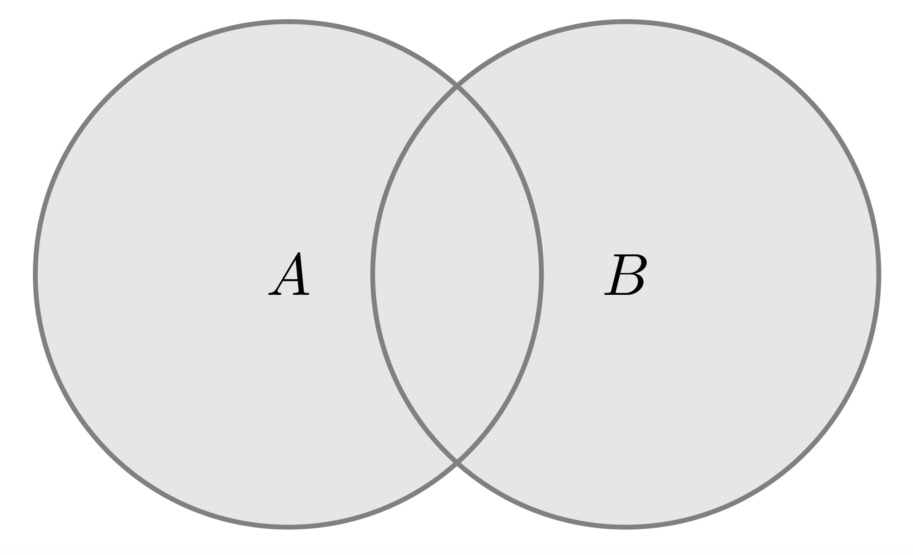
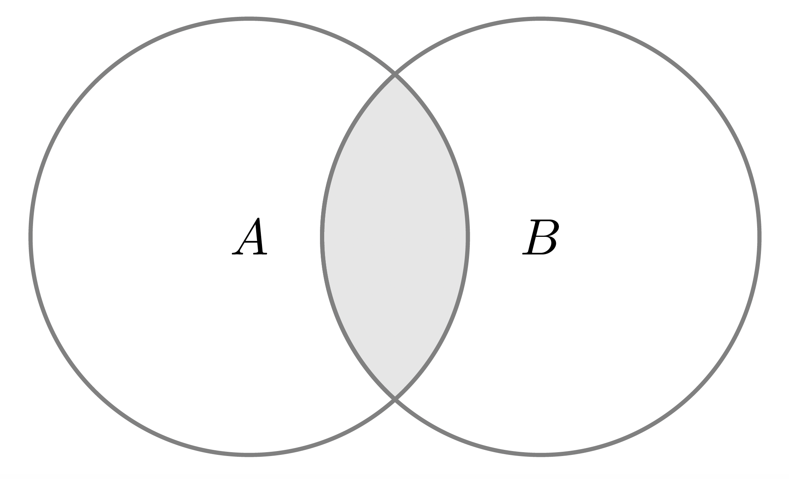
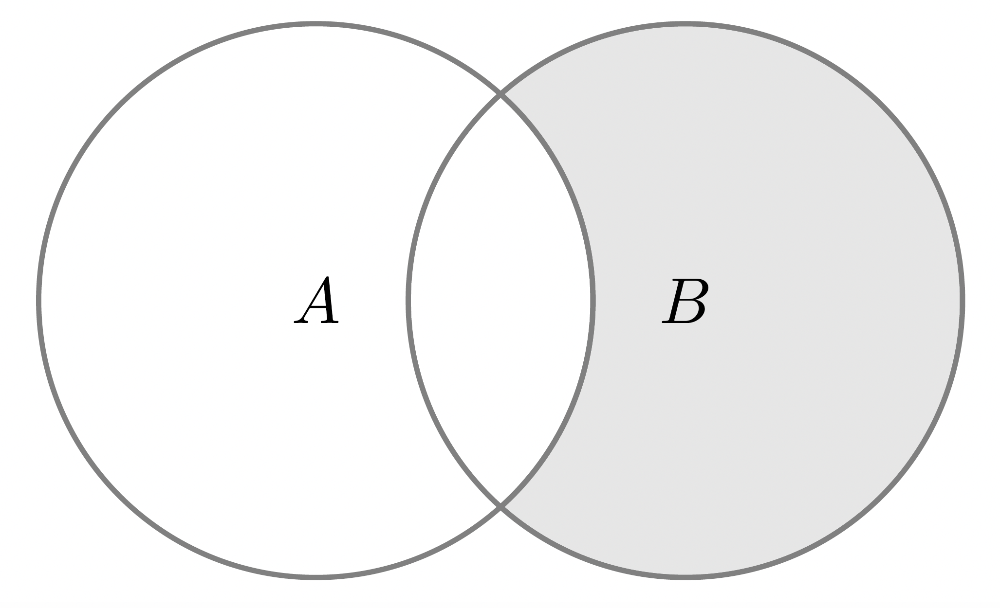

## 集合(Set)

所謂集合，係一個將具**特定性質**之具體或抽象對象匯集的整體，其中稱的對象即是集合中的元素(element)。一般來說，我們會用以下方式分別表示集合與其中的元素：

- 集合：大寫字母，如 $S, T, A, B, X, Y, \cdots$

- 元素：小寫字母，如 $s, t, a, b, x, y, \cdots$

若 $x$ 是集合 $S$ 的元素，則寫成 $x \in S$；若 $y$ 非 $S$ 的集合，則寫成 $y \notin S$。常見的集合包含整數、正整數、實數等集合，分別記作 $\mathbb{Z}, \mathbb{N}^{+}, \mathbb{R}$。

集合的表示方式包含以下兩種，但首先必須注意，我們必須大括號將集合內的元素包住，即 $\{\}$。

1. 枚舉法：即將集合內所有元素列出，如色光三原色(primary color)可以表示為
$$
\text{primary color} = \{\text{red}, \text{green}, \text{blue}\}
$$

但如果是像正整數這種元素個數無限延伸的集合，我們為了方便，會用 $\cdots$ 省略中間的部分元素，如
$$
\mathbb{N}^{+} = \{1,2, \cdots, n, \cdots\}
$$

或是整數可以表達為
$$
\mathbb{Z} = \{0, \pm 1, \pm 2, \cdots, \pm m, \cdots\}
$$

2. 描述法：若集合 $S$ 內的元素 $x$ 可透過某種特性 $P(\cdot)$ 描繪，我們便用表達式的方式將其寫下，即
$$
S = \{x\lvert P(x)\}
$$

例如我們將 $2$ 的平方根匯集起來形成一個集合：
$$
A = \{x \lvert x^{2} = 2\}
$$
再例如我們可以將有理數透過下列的方式表達：
$$
\mathbb{Q} = \{x\lvert x = \frac{q}{p}, p \in \mathbb{N}^{+}, q \in \mathbb{Z}\}
$$

注意到以下兩個概念：

- 集合中的元素沒有次序關係：也就是說集合內的元素先出現或後出現不具任何特殊意義。此外，重複也不具任何意義。

- 空集合(empty set)：即集合內不包含任何元素，記成 $\varnothing$，例如
$$
\varnothing = \{x \lvert x \in \mathbb{R} \text{ and } x^{2} + 1 = 0\}
$$

### 子集(Subset)

假設存在兩個集合 $S$ 與 $T$，若 $S$ 的所有元素都屬於 $T$，則稱 $S$ 為 $T$ 的子集，記為 $S \subset T$。我們上面提到的一些重要集合的關係也可以用子集表示：
$$
\mathbb{N}^{+} \subset \mathbb{Z} \subset \mathbb{Q} \subset \mathbb{R}
$$

而根據 $S$ 與 $T$ 的關係，可以得到以下推論：
$$
x \in S \Rightarrow x \in T
$$

其中 $\Rightarrow$ 表示隱含(imply)。若 $S$ 至少有一個元素不屬於 $T$，則稱 $S$ 不為 $T$ 的子集，記為 $S \not\subset T$。

若 $S \subset T$，但在 $T$ 中存在一個元素 $x$ 不屬於 $S$，則稱 $S$ 為 $T$ 的真子集(proper set)，記成 $T \not\subset S$。

【命題 1.1】： 若 $S$ 為一個集合，則
$$
S \subset S, \varnothing \subset S
$$

白話文翻譯就是：若空集合不是 $S$ 的子集，則在空集合中可以至少找到一個元素不屬於 $S$，然而空集合不包含任何元素空集合是 $S$ 的子集。

【例】 令 $T = \{a, b, c\}$，求其子集。

【解】 $T$ 的子集可以列舉如下：

$$
\varnothing, \{a\}, \{b\}, \{c\}, \{a, b\}, \{b, c\}, \{a, c\}, \{a, b, c\}
$$

可知 $T$ 有 $2^{3} = 8$ 個子集，且有 $2^{3} - 1 = 7$ 個真子集。

$\square$

【定義 1.1】假設集合 $S$ 與 $T$ 的元素都相等，則稱 $S$ 與 $T$ 相等，記成
$$
S = T \Longleftrightarrow S \subset T \text{ and } T \subset S
$$

在數學分析中，我們常見到的集合是 $\mathbb{R}$，因此以下針對其子集進行說明。討論實數的子集時，一般來說都是區間(interval)，包含：

- 開區間(open interval)：
$$
(a, b) = \{x \lvert x \in \mathbb{R} \text{ and } a < x < b\}
$$

- 閉區間(closed interval)：
$$
[a, b] = \{x \lvert x \in \mathbb{R} \text{ and } a \leq x \leq b\}
$$

- 半開半閉區間(semi-open-closed interval)：
$$
\begin{aligned}
(a, b] &= \{x \lvert x \in \mathbb{R} \text{ and } a < x \leq b\}\\
[a, b) &= \{x \lvert x \in \mathbb{R} \text{ and } a \leq x < b\}
\end{aligned}
$$

若一區間表示為 $(-\infty, \infty)$，即代表整個實數。

### 集合的關係與運算

如同數字一般，集合也有其四則運算，分別為聯集、交集、差集、補集。假設 $A$ 與 $B$ 為兩個集合，則

- 聯集(union)：所謂聯集，代表 $A$ 與 $B$ 中所有元素匯集的集合，記為
$$
A \cup B = \{x \lvert x \in A \text{ or } x \in B\}
$$

圖示如下：

{fig.aling='center' width='50%'}

- 交集(intersection)：即 $S$ 與 $T$ 共同元素匯集而成的集合，記為
$$
A \cap B = \{x \lvert x \in A \text{ and } x \in B\}
$$

示意圖如下：

{fig.aling='center' width='50%'}

例如我們令 $S = \{a, b, c\}$ 與 $T = \{b, c, d, e\}$，則
$$
\begin{aligned}
A \cup B &= \{a, b, c, d, e\}\\
A \cap B &= \{b, c\}
\end{aligned}
$$
- 差集(minus)：指屬於 $B$ 但不屬於 $A$ 的元素之集合，記為
$$
B \setminus A = \{x \lvert x \in B \text{ and } x \notin A\}
$$

也就是說扣除屬於 $B$ 的元素，剩下的就是 $A$ 的元素。示意圖如下：

{fig.aling='center' width='50%'}

- 補集(complement)：假設空間 $S$ 中僅有 $X$ 這個集合，則其補集定義為
$$
X^{c} = \{x \lvert x \in S \text{ and }x \notin X\} = S \setminus X
$$

【例】若 $S = (a, b)$，則 $S^{c} = (-a, a] \cup [b, +\infty)$

集合具有一些性質：

1. 交換律(commutative property)：
$$
\begin{aligned}
A \cup B &= B \cup A\\
A \cap B &= B \cap A
\end{aligned}
$$

2. 結合律(associative property)：
$$
\begin{aligned}
(A \cup B) \cup C &= A \cup (B \cup C)\\ 
(A \cap B) \cap C &= A \cap (B \cap C)
\end{aligned}
$$

3. 分配律(distributive property)：
$$
\begin{aligned}
A \cap (B \cup C) &= (A \cap B) \cup (A \cap C)\\
A \cup (B \cap C) &= (A \cup B) \cap (A \cup C)
\end{aligned}
$$

若 $n \geq 1$，則

$$
\begin{aligned}
B \bigcap \left(\bigcup^{n}_{i = 1}A_{i}\right) &= \bigcup^{n}_{i = 1}\left(B \bigcap A_{i}\right)\\
B \bigcup \left(\bigcap^{n}_{i = 1}A_{i}\right) &= \bigcap^{n}_{i = 1}\left(B \bigcup A_{i}\right)\\
\end{aligned}
$$

4. De Morgan 法則：

$$
\begin{aligned}
(A \cup B)^{c} &= A^{c} \cap B^{c}\\
(A \cap B)^{c} &= A^{c} \cup B^{c}
\end{aligned}
$$

若 $n \geq 1$，則

$$
\begin{aligned}
\left(\bigcup^{n}_{i = 1}A_{i}\right)^{c} = \bigcap^{n}_{i = 1}A_{i}^{c}\\
\left(\bigcap^{n}_{i = 1}A_{i}\right)^{c} = \bigcup^{n}_{i = 1}A_{i}^{c}
\end{aligned}
$$

