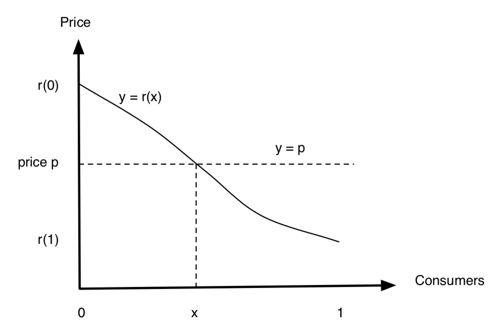
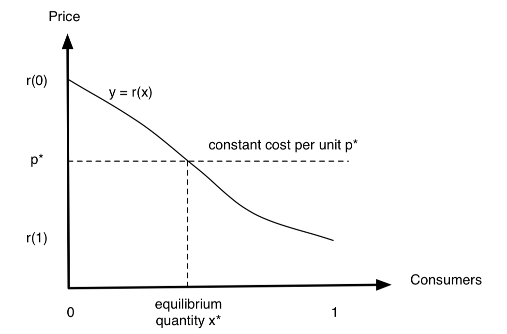
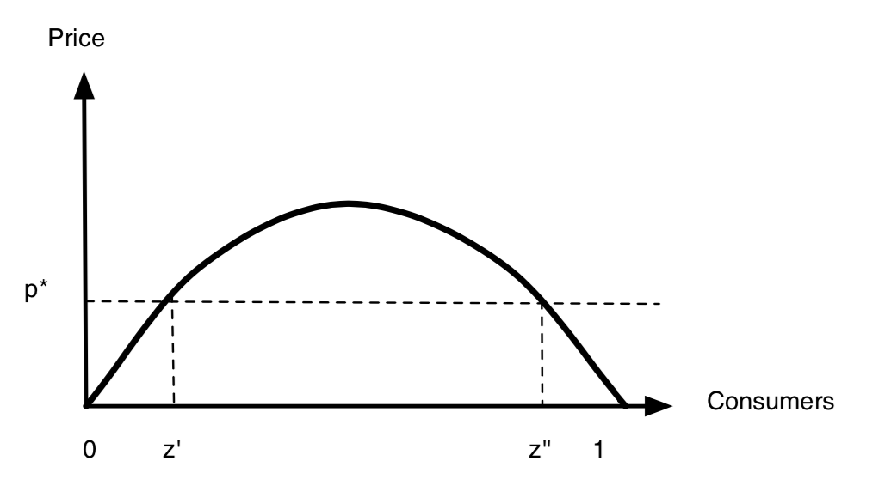
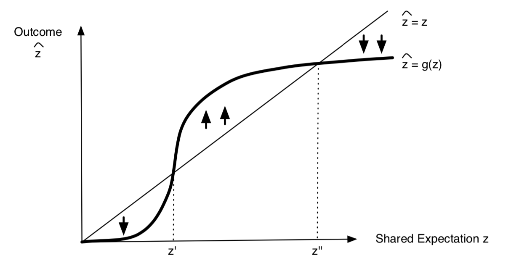
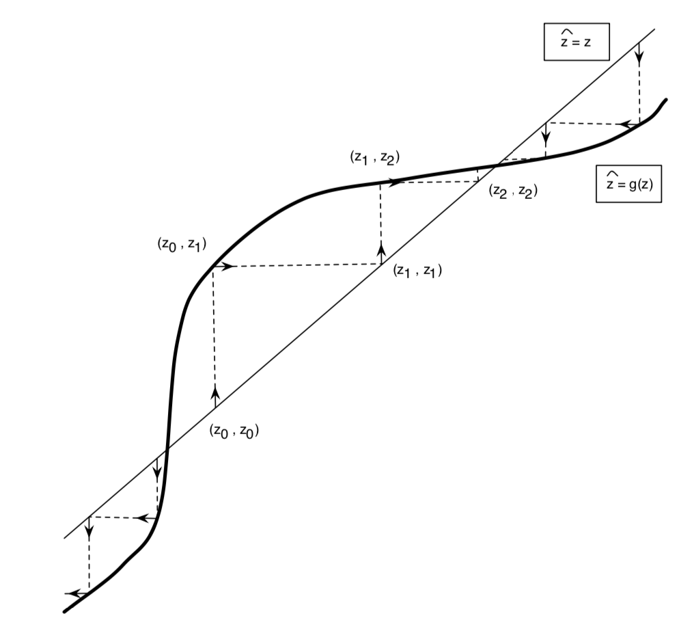

Here is a brief review of the theory of information cascade. There are two main ways that affect how an individual makes decisions:

- Information effect: only care about the process that influences individual decision-making
- Direct benefit effect or network effect: care both the process that influences individual decision-making and benefits after the decisions

## The Economy without Network Effects

Consider a big market of a specific good, where there are numerous consumers and producers. Each one of them has a little ability to influence how the market works.

Let $x$ be a fraction of the population, where $x \in \mathbb{R}$ and $x \in [0, 1]$. Suppose each consumer wants at most one unit of the good; each consumer has a personal intrinsic interest in obtaining the good that can vary from one consumer to another. Here we employ the idea of reservation price to quantify their intrinsic interests. 

### Reservation Price

We use $r(x)$ to denote the reservation price of consumer $x$ and we will assume that this function $r(\cdot)$ is continuous. $r(x)$ has the following assumptions:

- $r(x)$ is strictly decreasing, which means there is no same price in terms of each consumer.
- $r(x_i) > r(x_j),\; \forall i < j$.
- $r(\cdot)^{-1}$ is called demand function.

### Product Price and Cost

Now we shift our focus to the price of the product. Let $p$ be the price of the product. Intuitively, consumer $x$ would buy one if $r(x) > p$. If $p > r(0)$, there would not be any consumers buying the product; if $p < r(1)$, all the consumers would buy the product. That is,

Let's suppose that this good can be produced at a constant
cost of $p^*$ per unit. In aggregate, the producers will be willing to supply any amount of the good at a price of $p^*$ per unit, and none of the good at any price below $p^*$.

### Equilibrium Quantity and Social Optimal

If there exist a $x^*$ such that $r(x^*) = p^*$, then we call this $x^*$ equilibrium quantity. 

If society were going to produce enough of the good to give it to an $x$ fraction of the population, then social welfare would be maximized by giving it to all consumers between $0$ and $x$, since they correspond to the $x$ fraction of the population that values the good the most.

The welfare of each consumer can be represented as $w(x)$, where 

$$
w(x) = 
\begin{cases}
r(x) - p,& \; x\text{ buy the product; }\\
0, &\; x\text{ does't buy the product.}
\end{cases}
$$
Therefore, the social welfare can be calculated by
$$
S = \int_0^1 w(x)dx.
$$
Hence our target is to maximise the social welfare, i.e.,

$$
\max S = \max \int_0^1 w(x)dx.
$$
## The Economy with Network Effects

Based on the previous settings, now suppose there is a $z$ fraction of population using the product, which give them benefit with $f(z)$, and $z$ is known. The reservation price of consumer $x$ is equal to $r(x)f(z)$, where
$r(x)$ as before is the intrinsic interest of consumer $x$ in the good, and $f(z)$ measures the benefit to each consumer from having a $z$ fraction of the population use the good. Note that $f(\cdot)$ is increasing in $z$, which controls how much more valuable a product is when more people are using it.

We will assume that $f(0) = 0$: if no one has purchased the good no one is willing to pay anything for the good. We will also assume that f is a continuous function. Finally, to make the discussion a bit simpler, we will assume that $r(1) = 0$. Suppose that the price of the good is $p^*$, and that consumer $x$ expects a $z$ fraction of the population will use the good. Then $x$ will want to purchase provided that 

$$
r (x)f (z) > p^*.
$$
### Self-fulfilling Expectations Equilibrium

If everyone expects that a $z$ fraction of the population will purchase the product, then this expectation is in turn fulfilled by people's behaviour. Consider a value of $z$ strictly between $0$ and $1$. If exactly a $z$ fraction of the population purchases the good, which set of individuals does this correspond to? 

The set of purchasers will be precisely the set of consumers between $0$ and $z$. In order for exactly this set of consumers, and no one else, to purchase the good, we must have 

$$
p^* = r (z)f (z)
$$

If the price $p^* > 0$ together with the quantity z
(strictly between 0 and 1) form a self-fulfilling expectations equilibrium, then $p^* = r (z)f (z)$.

Consider an example in which $r(x) = 1 - z$ and $f(z) = z$, then $r(z)f(z) = z(1-z)$.

To find the maximumn of the reservation price, we then take the first derivative of the above equation:

$$
\frac{\partial p^*}{\partial z} = 1 - 2z \overset{*}{=} 0 \Rightarrow z = \frac{1}{2}.
$$

Hence, the maximum reservation price is $\frac{1}{4}$, occurring at $z = \frac{1}{2}$.

- If $p^* > \frac{1}{4}$ , then there is no solution to
$p^* =r(z)f(z) = z(1-z)$, and so the only equilibrium is when $z = 0$. This corresponds to a good that is simply too expensive, and so the only equilibrium is when everyone expects it not to be used.

- When $0 < p^* < \frac{1}{4}$, there are two solutions to $p^* = z(1-z)$, name these z0 and z00. Thus there are three possible equilibria in this case: when $z$ is equal to any of 0, $z'$, or $z''$. For each of these three values of $z$, if people expect exactly a $z$ fraction
of the population to buy the good, then precisely the top $z$ fraction of the population will do so.

### Analysis of the Equilibriums

Suppose $z$ is not $0$, $z'$ or $z''$, then 

- if $0 < z < z'$, then $z$ would move to $0$ (decreasing)
- if $z' < z < z''$, then $z$ would move to $z''$ (increasing)
- if $z > z'$, then $z$ would move to $z''$ (decreasing)

The analysis above show that $z''$ has a strong stability
property. Thus, $z'$ is not just an unstable equilibrium; it is really a critical point, or a tipping point, in the success of the good. The value $z'$ is the hump the firm must get over in order to succeed.

The high equilibrium $z''$ would move right, so if the firm is able to get past the critical point, the eventual size of its user population $z''$ would be even larger.

### A Dynamic View of the Market

f everyone believes a z fraction of the population will use the product, then consumer x | based on this belief | will want to purchase if $r(x)f(z) > p^*$. 

If anyone at all wants to purchase, the set of people who will purchase will be between 0 and ^z, where ^z solves the equation $r(\hat{z})f(z) = p^*$. Then we have 
$$
\hat{z} = r^{-1}\left(\frac{p^*}{f(z)}\right).
$$
We can only use this equation when there is in fact a value of $\hat{z}$ that solves the equation above. Otherwise, the outcome is simply that no one purchases.

In general, we can define a function $g(\cdot)$ that gives the outcome $\hat{z}$ in terms of the shared expectation $z$ as follows. When the shared expectation is $z \geq 0$, the outcome is $\hat{z} = g(z)$, where

$$
g(\hat{z}) = 

\begin{cases}
r^{-1}\left(\frac{p^*}{f(z)}\right),& \; \frac{p^*}{f(z)} \geq r(0)\\
0, &\; \text{o.w.}
\end{cases}
$$
Continue the example. Suppose $r(x) = 1 - x$, and $f(z) = z$. Then $r^{-1}(x) = 1 - x$, and $z(0) = 1$, and so the condition $\frac{p^*}{f(z)} \leq r(0)$ reduces to $z \geq p^*$. Thus,

$$
g(\hat{z}) = 

\begin{cases}
1 - \frac{p^*}{z},& \; \text{if } z \geq p^* \\
0, &\; \text{o.w.}
\end{cases}
$$

- When the curve $g(z)$ is above the straight line, there is an upward pressure.
- When the curve $g(z)$ is below the straight line, there is a downward pressure.

Furthermore, we can consider the case of whether participating the network or not, which is a better case of illustrating the dynamic behaviour. Suppose $z$ would change with time, and the time is discrete, i.e., $t = 1,2, \cdots, T$. That is, $z_t=g(z_{t-1})$, because $g$ is a function that maps intended buyers to actual buyers, and the actual buyers at time $t=t-1$ will be the intended buyers at time $t=t$. Hence we can have the following graph to depict the dynamic behaviours. 

