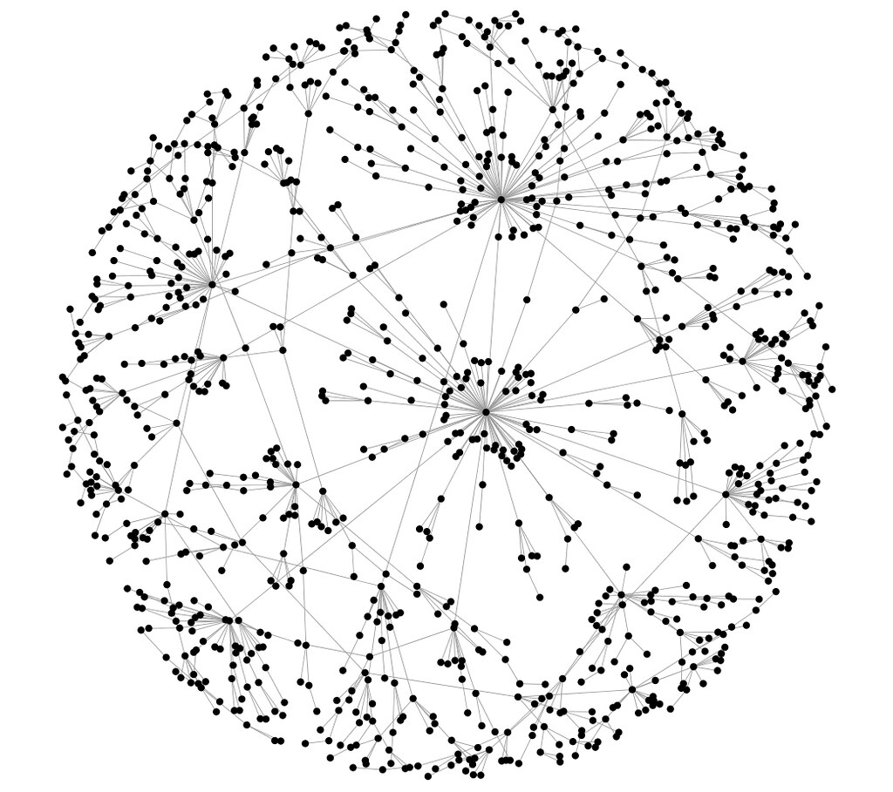
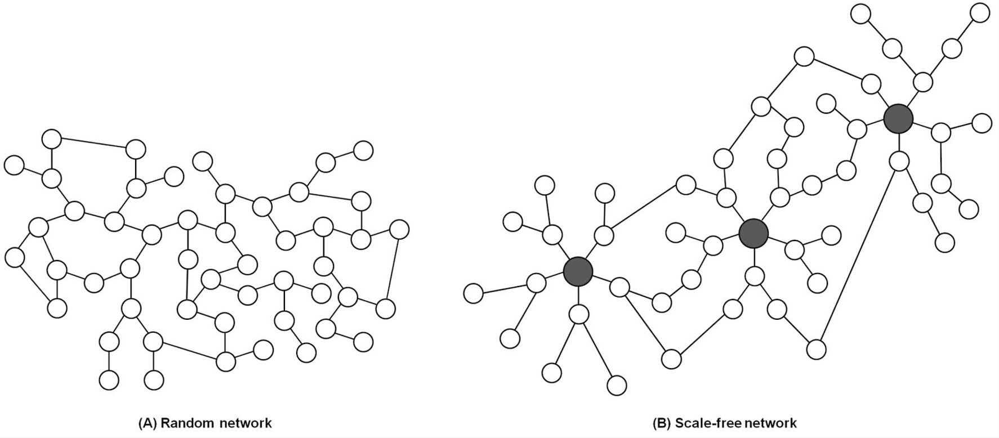
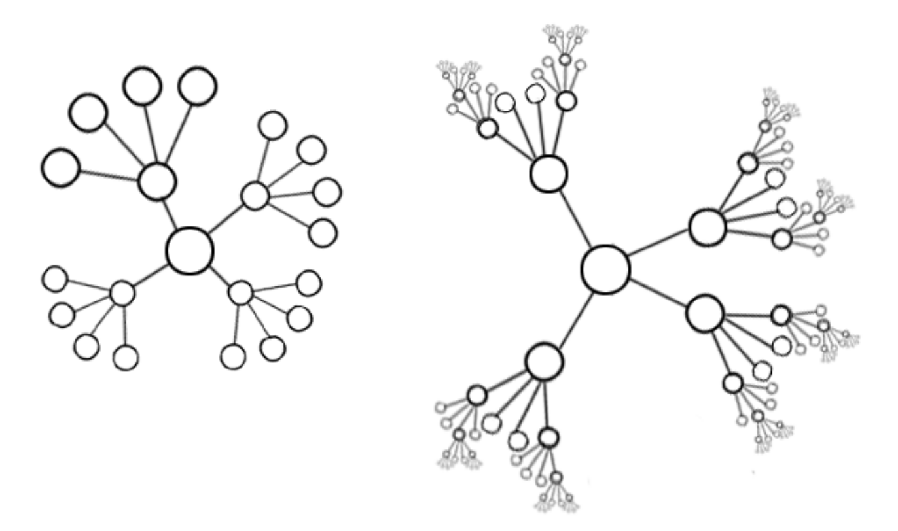
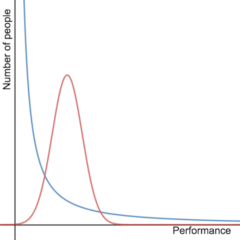
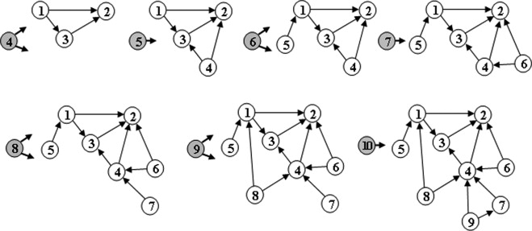

We've seen that behavior is correlated across a population,
and it can lead to outcomes very different from what we find
in cases where individuals make independent decisions. Here we apply this network approach to analyze the general
notion of popularity. 

> _While almost everyone goes through life known only to people in their immediate social circles, a few people achieve wider visibility, and a very, very few attain global name recognition_.

## Popularity

Popularity is a phenomenon characterized by extreme imbalances.



A network is called scale-free if the characteristics of the network are independent of the size of the network. That means that when the network grows, the underlying structure remains the same.

[^1]

[^1]:Seo, H., Kim, W., Lee, J., & Youn, B. (2013). Network-based approaches for anticancer therapy. International journal of oncology, 43(6), 1737-1744.

[^2]

[^2]:[https://www.futurelearn.com/info/courses/complexity-anduncertainty/0/steps/1855](https://www.futurelearn.com/info/courses/complexity-anduncertainty/
0/steps/1855)

### Case: Web

Consider a Web such as Google, Amazon, or Wikipedia. We will define the full set of links pointing to a specific web page as the "in-links" to that page. Consequently, our initial approach will be to consider the number of in-links to a web page as a metric for measuring its popularity. However, it's important to recognize that this is just one instance of a broader phenomenon.

In the early stages of the Internet's development, people had already begun asking a fundamental version of the question regarding page popularity, which can be formulated as follows:

> _As a function of $k$, what fraction of pages on the Web have $k$ in-links?_

Since higher values of $k$ indicate greater popularity, this question essentially explores how popularity is distributed across the entire set of web pages. 

### Hypothesis: The Normal Distribution

```{r, message=FALSE, include=FALSE}
x <- seq(-4, 4, length=1000)
y = dnorm(x)
plot(x, y, type = "l", col = "deepskyblue3")
```

If we believe this model, then the number of pages with $k$ in-links should decrease exponentially in $k$, as $k$ grows large.

### Power Law

In studies over many different Web snapshots, taken at
different points in the Web’s history, the recurring finding is that the fraction of Web pages that have $k$ in-links is
approximately proportional to $\frac{1}{k^2}$.

A function that decreases as k to some fixed power, such as
$\frac{1}{k^2}$ in the present case, is called a power law; when used to measure the fraction of items having value $k$, it says, qualitatively, that it’s possible to see very large values of $k$.


Let $f(k)$ be the fraction of items that have value $k$, and
suppose you want to know whether the equation $f(k) = \frac{a}{k^c}$ approximately holds, for some exponent $c$ and constant of proportionality a. Then, if we write this as $f (k) = ak−c$ and take the logarithms of both sides of this equation, we get 
$$
\log f (k) = \log a − c \log k.
$$

Therefore, it is easy for us to know if the data follows power law by checking out whether the curve after taking the logarithms is straight or not.

## Rich-Get-Richer Models

We will assume simply that people have a tendency to copy
the decisions of people who act before them. Here is a simple model for the creation of links among Web pages.

1. Pages are created in order, and named $1, 2, 3, \cdots,N$.
2. When page $j$ is created, it produces a link to an earlier Web page according to the following probabilistic rule (which is controlled by a single number $p$ between $0$ and $1$).
  - With probability $p$, page $j$ chooses a page $i$ uniformly at
random from among all earlier pages, and creates $a$ link to this page $i$ .
  - With probability $1 − p$, page $j$ instead chooses a page $i$ uniformly at random from among all earlier pages, and creates a link to the page that $i$ points to.
  - This describes the creation of a single link from page $j$; one can repeat this process to create multiple, independently generated links from page $j$ .
  
Note that after finding a random earlier page $i$ in the
population, the author of page $j$ does not link to $i$ , but
instead copies the decision made by the author of page $i$–
linking to the same page that $i$ did. We call this the copying mechanism.

The main result about this model is that if we run it for many pages, the fraction of pages with $k$ in-links will be distributed approximately according to a power law $\frac{1}{k^c}$, where the value of the exponent $c$ depends on the choice of $p$. Here is an intuition: as $p$ gets smaller, so that copying becomes more frequent, the
exponent $c$ gets smaller as well, making one more likely to see extremely popular pages.

Let $V_h$ be the amount of the in-link of page $h$, $N$ be the amount of all in-link. Hence, $\frac{V_h}{N}$ is the probability of page $h$ being chosen.

Because the probability that page $h$ experiences an increase in popularity is directly proportional to $h$’s current popularity. This phenomenon is also known as preferential attachment. A page that gets a small lead over others will therefore tend to extend this lead.

[^3]

[^3]:Figure from Zadorozhnyi and Yudin (2015)

### The Unpredictability of Rich-Get-Richer Effects

Given the nature of the feedback effects that produce power
laws, it’s natural to suspect that for a Web page, a book, a
song, or any other object of popular attention, the initial
stages of its rise to popularity is a relatively fragile thing. This sensitivity to unpredictable initial fluctuations is something that we saw in the previous two chapters as well: information cascades can depend on the outcome of a small number of initial decisions in the population, and a worse technology can win because it reaches a certain critical audience size before its competitors do.

<!-- ### Analysis of Rich-Get-Richer Processes -->

<!-- Now that we have already known the idea of rich-get-richer model, we provide a heuristic argument that analyzes the behavior of the model to indicate why the power law arises, and in fact goes further to show how the power-law exponent $c$ is related to more basic features of the model. -->


