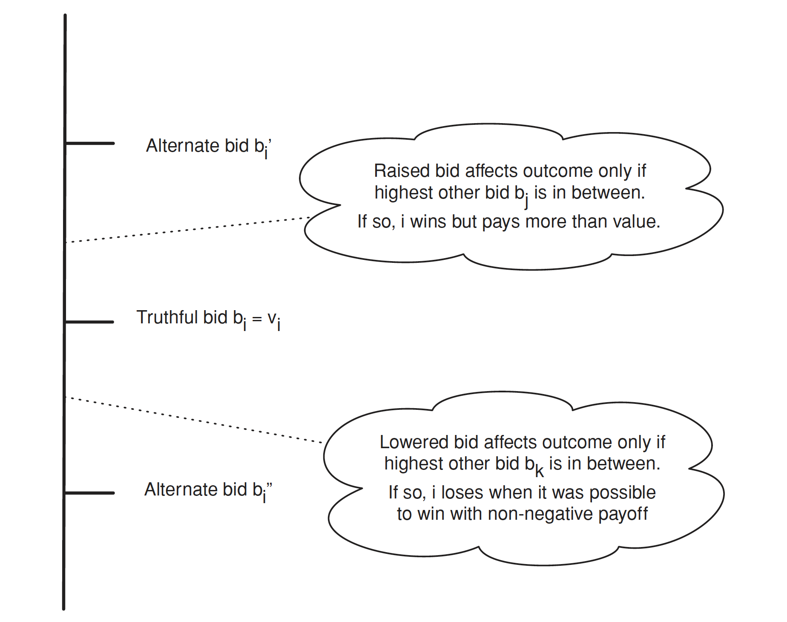

拍賣理論是經濟學中研究拍賣機制和參與者行為的一個重要領域。在拍賣中，賣方將貨品或服務提供給潛在的買家，通過競價來確定最終的交易價格。其目標是研究不同拍賣機制對參與者行為和結果的影響。這些機制包括公開拍賣、密封拍賣、一次性拍賣、多輪拍賣等。拍賣理論探討了參與者的策略和行為，例如出價策略、競爭行為、風險評估等。拍賣理論的一個重要概念是拍賣的均衡，即在特定的拍賣機制下，參與者的策略形成一個均衡狀態，沒有誘因改變策略。這些均衡可以是純策略均衡，也可以是混合策略均衡。

## 拍賣機制

我們目前僅討論以下四種拍賣機制：

- Ascending-bid auctions：也稱為英式拍賣(English auctions)賣方逐漸提高價格，競標者退出，直到最後只剩下一位競標者，該競標者以最後的價格贏得物品。

- Descending-bid auctions：也稱為荷蘭拍賣(Dutch auctions)，這也是一種互動式拍賣形式，賣方從一個較高的初始價格逐漸降低價格，直到第一個競標者接受並支付當前價格為止。

- First-price sealed-bid auctions：競標者向賣方同時提交「封閉競標」(sealed bids)，最高競標者贏得物品並支付其標金。

- Second-price sealed-bid auctions：也稱為 Vickrey
拍賣。競標者向賣方同時提交封閉競標，最高競標者贏得物品並支付第二高標金。

在討論之前，我們必須先釐清：何時適合使用拍賣？基本上拍賣的使用時機就是某一特定商品市場中的買賣雙方均不知道該商品的真實價格，就適合使用拍賣。因為如果買方知道賣方的願售價格，那麼就用該價格進行進行購買；反之，若賣方知道買方的願付價格，則賣方便可對於該商品標售該價格。

在數學上，Descending-bid auction 與 First-price sealed-bid auctions 的概念是相同的。對 Descending-bid auction 機制而言，假設競標者估價為 $b$，當賣方逐步降價時，若價格達到使競標者能接受的價格 $b$ 時，該競標者就會買下。

同樣地，Ascending-bid auction 及 Second-price sealed-bid auctions 在數學上是一樣的。在假設每位競標者的估價為 $b$ 的情況下，Ascending-bid auction 中，最高估價的競標者將獲勝。由於這是逐步出價的拍賣，最高出價的買方只需要超過次高出價的買方即可獲勝，不需要出到自己的估價。因此，這與 Second-price sealed-bid auctions 相同，競標者獲勝後只需支付次高出價的價格。

因此我們以下針對 First-price sealed-bid 與 Second-price sealed-bid auctions 的內容進行討論。

## Second-price sealed-bid auctions

在 Second-price sealed-bid auctions 中，競標者的最佳策略是「誠實為上策」，浮報標金將會使效用降低。

> *Truth-telling is a dominant strategy in a second-price sealed-bid auction.*

首先，此機制的運作規則如下。令 $b_i$ 為競標者 $i$ 的標金，則給定一組競標者 $b = (b_1, b_2, \cdots, b_n)$ 之下，競標者 $i$ 贏得拍賣商品的條件為

- 若 $b_i > b_j, \; \forall j \neq i$；
- 若 $b_i \geq b_j, \; \forall j \neq i$ 且 $\exists \;j$ 使得 $b_i = b_j$ 且是隨機從 $\{k:b_k=b_i\}$ 中抽出的。

其他情況則未得標。因此對於競標者 $i$ 而言，其效用可表達為

$$
u_i(b) = 
\begin{cases}
  &v_i - b_{(2)}, \;\; &\text{ if } b_i>b_j, \;\; \forall j \neq i\\
  & 0, \;\; &\text{ otherwise.}
\end{cases}
$$
接下來我們要來證明為何在此機制下，競標者的投標策略必須是「誠實為上策」。

  

**《證》**以下我們分三個案例討論。

**Case 1**：$v_i > \underset{j \neq i}{\max} b_j$

- 若 $b_i > b_j$，則 $i$ 得標並支付 $b_j$，因此其報酬為
$$
v_i - b_j
$$

- 若 $b_i = b_j$，則 $i$ 有 $p$ 的機率得標並支付 $b_j$，因此其報酬為

$$
(v_i - b_j) \times p < v_i - b_j, \; \forall \;0 < p < 1
$$

- 若 $b_i < b_j$，則 $i$ 未得標，其報酬為 $0$。

因此在 Case 1 中，$b_i = v_i$ 為最佳策略。

**Case 2**：$v_i = \underset{j \neq i}{\max} b_j$

- 若 $i$ 得標，報酬為 $0$。

- 若 $i$ 未得標，其報酬為 $0$。

因此在 Case 2 中，$b_i = v_i$ 為最佳策略。

**Case 3**：$v_i < \underset{j \neq i}{\max} b_j$

- 若 $b_i > b_j$，則 $i$ 得標並支付 $b_j$，因此其報酬為
$$
v_i - b_j < 0
$$

- 若 $b_i = b_j$，則 $i$ 有 $p$ 的機率得標並支付 $b_j$，因此其報酬為

$$
(v_i - b_j) \times p < 0, \; \forall \;0 < p < 1
$$

- 若 $b_i < b_j$，則 $i$ 未得標，其報酬為 $0$。

因此在 Case 3 中，$b_i = v_i$ 為最佳策略。

綜上，在 Second-price sealed-bid auction 中，$b_i = v_i$ 對於競標者 $i$ 來說是最佳策略。

## First-price sealed-bid auctions

不同於 Second-price sealed-bid auction，First-price sealed-bid auction 的策略為壓低標價。

**《證》**以下我們假設競標者 $i$ 的價值 $i.i.d.$ 服從 $U(0,1)$，即 $v_i \overset{i.i.d.}{\sim} U(0,1)$，因此其標價為 $b_i:[0,1]\to[0,1]$。其 CDF 為

$$
\begin{aligned}
F_{n-1}(b) = \mathbb{P}(b_i \leq b) &= \mathbb{P}(\underset{j \neq i}{\max} v_j \leq b)\\
&= \prod_{j \neq i} \mathbb{P}(v_{j} \leq b) \\
&= b^{n-1}
\end{aligned}
$$
故 PDF 為

$$
\frac{\partial F_{n-1}}{\partial b} = (n-1)b^{n-2}.
$$

競標者 $i$ 的預期報酬為

$$
\begin{split}
\begin{aligned}
\mathbb{E}(b_{i} | b_{i} < v_{i}) &= \frac{\int_{0}^{v_{i}} b_{i}{f}_{n-1}(b_{i})db_{i}}{\int_{0}^{v_{i}} {f}_{n-1}(b_{i})db_{i}} \\
&= \frac{\int_{0}^{v_{i}}(n-1)b_{i}^{n-1}db_{i}}{\int_{0}^{v_{i}}(n-1)b_{i}^{n-2}db_{i}} \\
&= \frac{n-1}{n}b_{i}\bigg{|}_{0}^{v_{i}} \\
&= \frac{n-1}{n}v_{i}
\end{aligned}
\end{split}
$$

