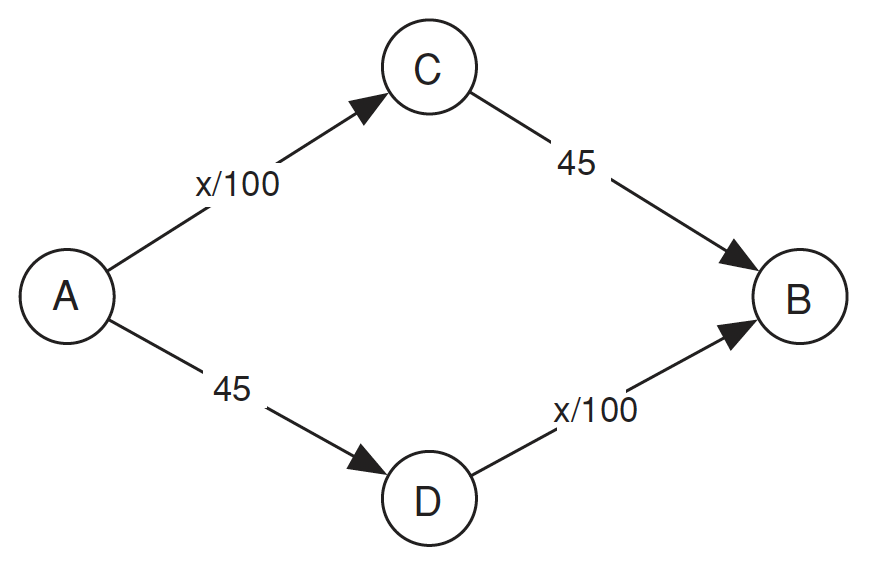
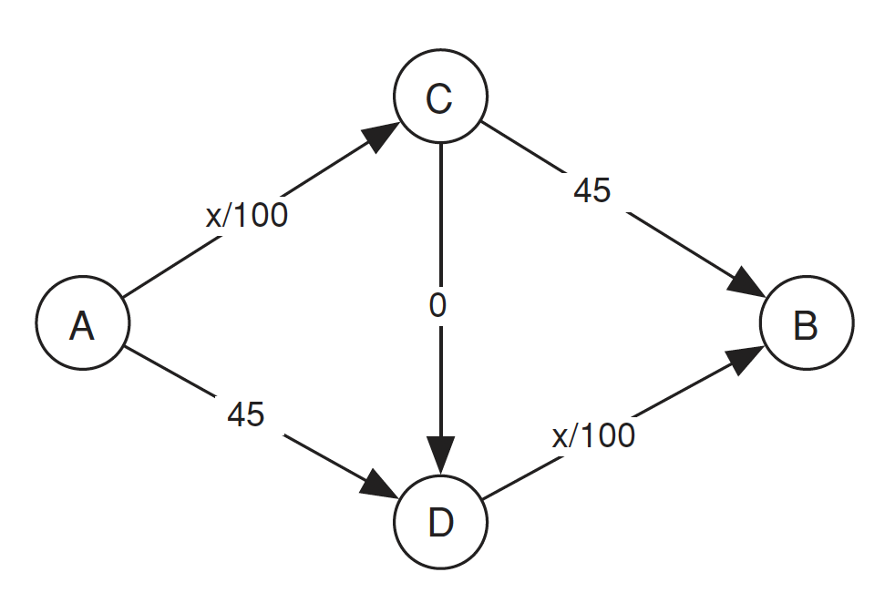

假設在一個國家內有兩個重要的城市，設為 $A$ 城與 $B$ 城，這兩個城市是該國的金融重鎮，每天都有許多人與車在這兩個城市之間往來。現在假設這個國家的所有駕駛都是要從 $A$ 城前往 $B$ 城，途中有兩條路可以選，一個是經過 $C$ 城，另一個則是經過 $D$ 城。以下是這個國家的交通流量網絡圖，每條路線都有一個指定的行駛時間(以分鐘計算)，該時間取決於該邊線上的交通量。

  

假設總共有 $4000$ 輛車要通過，其中通過 $AC$ 與 $DB$ 路線的時間皆為 $x / 100$，因此若全部的車輛被平均分配走上下的路，總時間為 $4000/100 + 45 = 65$ 分鐘。

我們所描述的交通模型實際上是一個賽局，其中行為者對應到駕駛，每個行為者的可能策略包括從 $A$ 到 $B$ 的可能路線。每個行為者的報酬是其行車時間的負值（我們使用負值是因為較長的行車時間是不好的）。這個賽局可以有任意數量的行為者，每個行為者可以有任意數量的可用策略，每個行為者的回報取決於所有行為者所選擇的策略。Nash equilibrium 仍然是一組策略，每個行為者對應一個策略，使得每個行為者的策略對於其他所有行為者都是最佳回應。

在這個交通賽局中，通常沒有優勢策略。然而，這個賽局其實存在 Nash equilibrium：任何一組策略中駕駛在兩個路線之間均衡分配，即每個路線上有 $2000$ 輛車的情況都是一個 Nash equilibrium，而這些是唯一的 Nash equilibrium。我們想要證明的是：假設每個人在每個路線上的行駛時間相等，則總是存在一個均衡。

## 證明 Nash equilibrium 存在[^1]

[^1]:Braess’s paradox - Wikipedia. (2023, March 24). Braess’s Paradox - Wikipedia. [https://en.wikipedia.org/wiki/Braess%27s_paradox](https://en.wikipedia.org/wiki/Braess%27s_paradox)

假設 $L_{e}(x)$ 是每個人在路線 $e$ 上行駛時的行駛時間函數，其中 $x$ 人選擇該路線。假設有一個交通網絡，其中 $x_{e}$ 人在路線 $e$ 上行駛。令 $T(e)$ 表示路線 $e$ 的時間，定義為：

$$
T(e) := \sum _{i=1}^{x_{e}}L_{e}(i)=L_{e}(1)+L_{e}(2)+\cdots +L_{e}(x_{e}),
$$

當 $x_e = 0$ 時，$T(e) = 0$。將交通網絡的總時間定義為圖中每條路線的時間之和。選擇一組能夠最小化總時間的路線。這樣的選擇必然存在，因為路線的選擇有限。這將成為一個均衡狀態。

假設存在一個相反的情況。那麼，至少有一名駕駛可以改變路線並改善行駛時間。假設原始路線為 $e_{0},e_{1},\cdots ,e_{n}$，而新路線為 $e'{0},e'{1},\cdots ,e'{m}$。令 $E$ 為交通網絡的總時間，考慮當移除路線 $e{0},e_{1}, \cdots e_{n}$ 時的情況。每條路線 $e_{i}$ 的時間將減少 $L_{e_{i}}(x_{e_{i}})$，因此 $T$ 將減少：

$$
\sum _{i=0}^{n}L_{e_{i}}(x_{e_{i}}).
$$

這就是取原始路線所需的總行駛時間。如果然後添加新路線 $e'{0},e'{1},\cdots ,e'_{m}$，則總時間 $E$ 將增加新路線所需的總行駛時間。因為新路線比原始路線更短，所以相對於原始配置，$T$ 必定下降，與假設原始路線最小化總能量的假設相矛盾。因此，最小化總時間的路線選擇是一個均衡狀態。

## Braess's Paradox

假設今天該國政府發現該年歲入存在餘額，在經過立法諸公商議後，決定在 $C$ 與 $D$ 之間蓋一條快速道路減少從 $A$ 城到 $B$ 城的時間(方向為 $C$ 到 $D$)。為了簡化，我們將該條快速道路所需的行使時間設定為 $0$，無論有多少車經過。

  

有趣的是，雖然在上述假設下的這個交通賽局仍然存在 Nash equilibrium，但他會讓每個駕駛的交通時間增加。注意到，沒有任何駕駛能從改變他們的路線中獲益：根據目前 $C$ 和 $D$ 之間蜿蜒的交通情況，任何其他路線現在都需要 $85$分鐘。

另外，為什麼這是唯一的均衡狀態？透過檢查建立在從 $C$ 到 $D$ 的快速道路是否實際上使得經過 $C$ 和 $D$ 的路線對所有駕駛來說都成為一種優勢策略：無論當前的交通模式如何，通過切換路線經過 $C$ 和 $D$，駕駛人都會受益。

