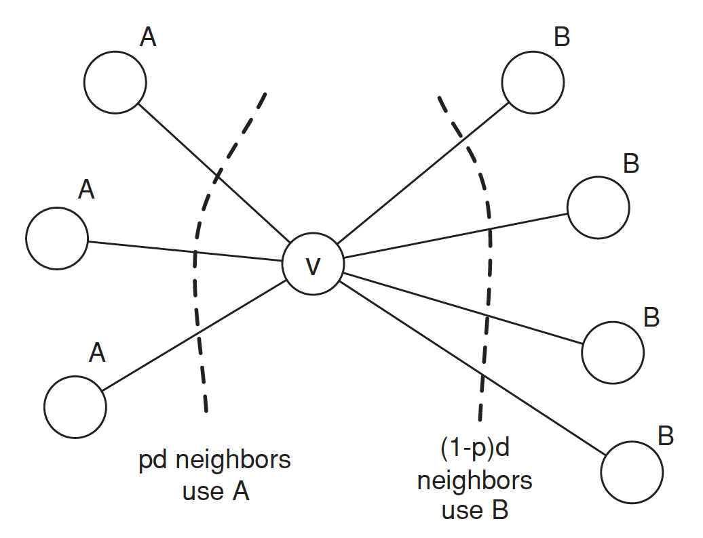
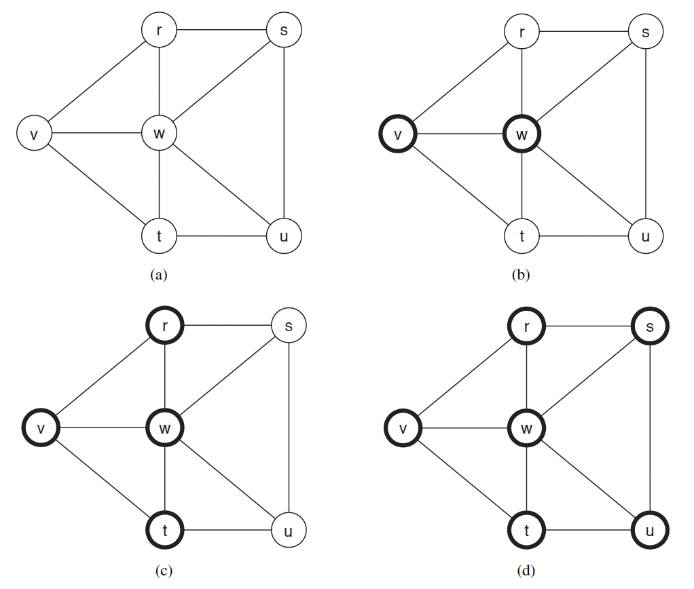
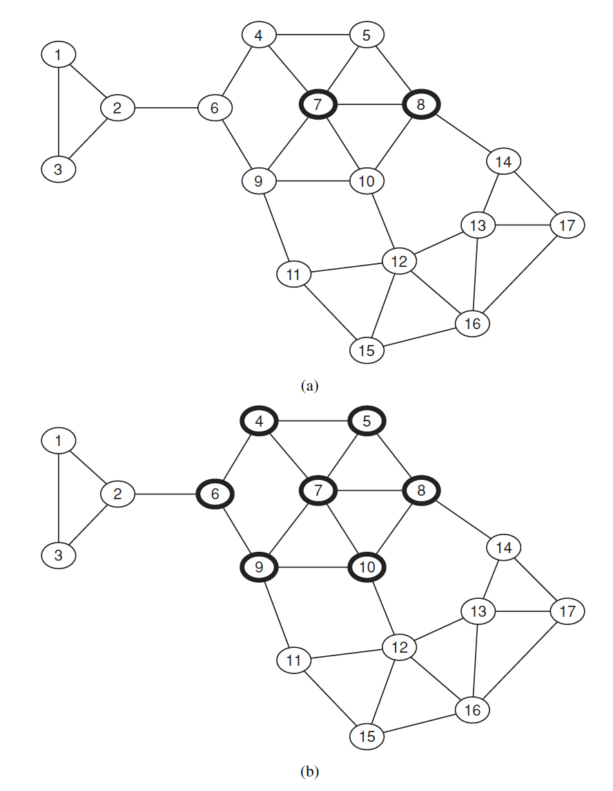
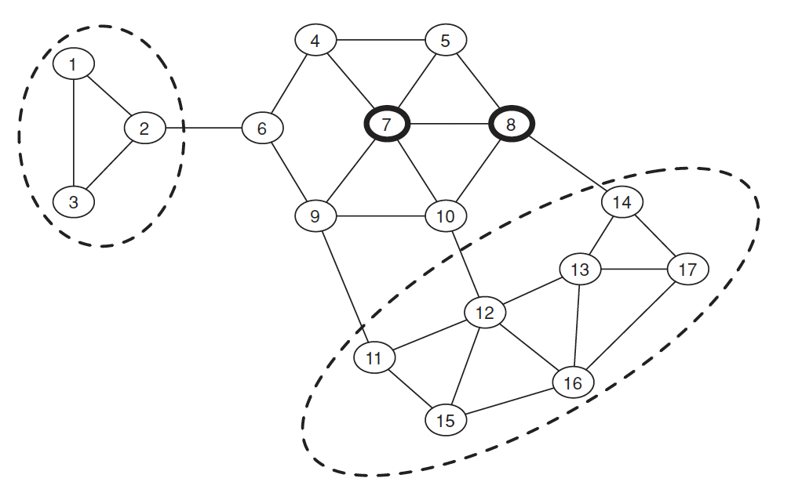

在前面幾個文章中，討論的焦點是個體的選擇如何取決於其他人的行為，以及新觀念和創新如何被一個群體所接受。當進行這種類型的分析時，底層的社群網絡可以在兩個概念上有非常不同的分辨率。現在我們更接近網絡的細節結構，看看個體是如何受其特定的網絡中的鄰居影響，將網絡視為一個圖形結構。

在網絡中，每個個體可以被視為一個節點，而節點之間的連接則表示他們之間的關系。這些連接可以是社交關系、合作關系、信息傳播等。個體在網絡中的位置和連接決定了他們所接觸到的信息和影響的範圍。網絡中的擴散過程涉及個體之間的相互作用和信息傳遞。當一個人做出決策或採取行動時，他們的鄰居可能會受到影響，並以類似的方式做出反應。這種信息傳遞可以通過直接的交流、觀察他人的行為或接收來自鄰居的信息來實現。研究網絡中的擴散過程可以幫助我們理解創新、信息傳播、行為變化等現象的產生和傳播方式。這種分析可以揭示網絡結構對個體決策和行為的影響，並為社會政策、市場營銷等領域提供有關如何影響和引導人們的決策的洞察。

## 創新在網絡中的擴散

信息效應(information effect)是指當人們發現鄰居採取某種行為後，他們會得到一些好處。每個人的收益並不受他人影響，但研究表明以下因素可能影響個體的決策：

- 創新和了解的缺乏：人們可能採用鄰居的行為，因為他們缺乏對新行為的了解，而採用它可能具有風險。
- 高利益回報：如果鄰居的行為可以帶來高利益，人們可能會模仿他們。

越早採用新行為的人通常社會地位較高，社交圈也較廣。人們通常通過觀察鄰居來決定是否採用某種行為。

直接利益(direct benefit)效應是指當人們發現鄰居採取某種行為後，他們會得到一些直接的好處。以下特性可能導致人們模仿鄰居的行為：

- 覆雜性：行為越簡單易行，人們越容易模仿。
- 可觀察性：如果好處很容易被觀察到，人們更有可能模仿。
- 可試用性：如果試用新行為的風險較小，人們更願意模仿。
- 符合社會習慣：如果鄰居的行為符合社會的習慣和規範，人們更容易接受並模仿。

總之，人們模仿鄰居的行為可以通過獲取信息或直接獲得好處來解釋。這種模仿行為受到覆雜性、可觀察性、可試用性和符合社會習慣的影響。了解這些原因可以幫助我們更好地理解人們在社群網絡中的行為和決策模式。

### 模型設定

在一個社群網絡中，我們將研究每個節點在兩種可能的行為（記為 $A$ 和 $B$）之間做出選擇的情況。
- 如果節點 $v$ 和 $w$ 之間存在一條邊，那麽他們有動機讓他們的行為相匹配。
- 我們使用一個遊戲來表示這一點，其中 $v$ 和 $w$ 是玩家，$A$ 和 $B$ 是可能的策略。

$$
\begin{array}
& & & & \text{w} \\
\hline
& & A & B & \\
\hline
& A & (a,a) & (0,0)\\
\text{v} & B & (0,0) & (b,b)\\
\hline
\end{array}
$$

報酬定義如下：

- 如果 $v$ 和 $w$ 都採用行為 $A$，則它們各自獲得 $a > 0$ 的報酬；
- 如果它們都採用行為 $B$，則它們各自獲得 $b > 0$ 的報酬；以及
- 如果它們採用相反的行為，則它們各自獲得 $0$ 的報酬。

每個節點 $v$ 與其鄰居之間都在進行這個遊戲的一次回合，並且它的報酬是在每條邊上進行的遊戲中的報酬之和。因此，$v$ 的策略選擇將基於其所有鄰居共同做出的選擇。

對於節點 $v$ 而言，它所面臨的基本問題如下：假設它的一些鄰居選擇了 $A$，而另一些選擇了 $B$，為了最大化其報酬，$v$應該怎麽做？假設 $v$ 的鄰居中有 $p$ 比例選擇了 $A$，而有 $(1 - p)$ 比例選擇了 $B$；也就是說，如果 $v$ 有 $d$ 個鄰居，則 $pd$ 選擇了 $A$，而 $(1 - p)d$ 選擇了 $B$。因此，如果 $v$ 選擇 $A$，則它的報酬為 $pda$；如果選擇 $B$，則報酬為 $(1 - p)db$。因此，如果

$$
pda \geq (1 − p)db
$$
移項整理後得

$$
p \geq \frac{b}{a+b}.
$$

  

我們定義 $q = \frac{b}{a+b}$，上述方程表明如果至少有 $q = \frac{b}{a+b}$ 的鄰居遵循行為 $A$，那麽節點 $v$ 也應該遵循，故我們可以將 $q$ 視為採用 $A$ 的門檻(threshold)。

- 當 $q$ 很小時，$A$ 是更具吸引力的行為，只需要一小部分鄰居採用 $A$，節點 $v$ 也會選擇 $A$。
- 如果 $q$ 很大，情況相反：$B$ 是有吸引力的行為，節點 $v$ 需要很多朋友採用 $A$ 才會轉為 $A$。

每個節點根據其鄰居的行為進行最佳決策。

### 實例

從 $v$ 和 $w$ 作為最初的採用者開始，假設 $a = 3$ 和 $b = 2$，新的行為 $A$ 在兩個步驟中傳播到所有節點。在給定步驟中採用 $A$ 的節點以深色邊框繪制；採用 $B$ 的節點以淺色邊框繪制。經過簡單的計算與分析，可得到以下結果：

  

根據上述的假設，我們今天考慮更大一點的網絡圖，並設定最初採用者為節點 7 與 8，則同樣經過計算，我們可得到以下結果：

  

### 小結

如果不是所有人都變成 $A$（完全傳遞），可能的原因有以下幾點：

1. 社群內部連結緊密：如果社群內部的連接比外部連接更緊密，新思想很難在這種緊密的社群中傳播。這可能是因為人們更多地受到社交影響，傾向於與自己的緊密聯系的人持相同的觀點和行為。

2. 不同年齡層和生活習慣：現實生活中，不同年齡層和生活習慣的人群可能形成了不同的社群，他們之間的交流和信息傳播受到限制。這會導致新思想無法跨越這些社群的邊界傳播。

3. 繼續傳播的策略：如果沒有有效的傳播策略，即使一些節點開始採用A，但新思想可能無法繼續傳播給其他節點。這可能是因為沒有足夠的激勵或機制來鼓勵其他節點采納新思想。

要促使更多節點採用 $A$，可以考慮以下方法：

- 提高 $A$ 的品質：如果 $A$ 具有更高的品質和吸引力，即使在緊密連結的社群中，$q$ 的門檻也會降低。通過改進 $A$ 的特點和優勢，吸引更多人採用 $A$。

- 在緊密連結的社群中引入轉變：在社群內部選擇一些節點進行轉變，讓他們成為新思想的先驅者。他們可以通過積極的態度和行為影響其他節點，推動新思想的傳播。

3. 研究節點轉變的策略：進一步研究和探索哪些節點最有可能轉變，以及如何選擇這些節點。可以考慮節點的影響力、社交地位、意見領袖等因素，制定有針對性的轉變策略。

通過以上措施，可以增加 $A$ 的採用率，並嘗試解決如何選擇節點進行轉變的新問題。

## 網絡內的緊密社群

我們的具體目標是將前面的例子中直觀明顯的事實形式化，即當新行為試圖進入網絡內部的緊密社群時，新行為的傳播可能會停滯不前。同質性通常會阻礙傳播，因為它使得創新很難從密集連接的社群外部到達。同質性指的是人們傾向於與自己具有相似特征、興趣和背景的人建立聯系和交流。當一個新的行為或觀念與社群內部的主流行為或觀念不一致時，由於同質性的存在，社群成員可能更加抵制接受新的行為或觀念，從而阻礙了傳播的發生。

這種現象在社群網絡中經常發生，它可以解釋為何一些創新和新思想無法輕易進入緊密社群中。社群內的人們傾向於受到自己社群成員的影響和認同，並與他們分享類似的價值觀和行為模式。因此，當一個新的行為或觀念與社群內部的主流行為或觀念相衝突時，它面臨著更大的阻力和抵制。

這個現象提醒我們在設計傳播策略時要考慮到社群的同質性。如果我們希望將新的行為或觀念傳播到一個緊密社群中，我們可能需要采取特定的策略，例如尋找社群內的意見領袖或關鍵人物來推廣和引領新行為的接受，或者設計與社群價值觀相吻合的傳播信息，以減輕同質性帶來的阻力。

### 緊密社群(Cluster)
一個密度為 $p$ 的緊密社群，是指一個節點集合，其中每個節點至少有 $p$ 的比例的鄰居也在這個集合中。在網絡中可以同時存在多個不同規模的緊密社群。

緊密社群的缺點如下：

- $p=1$ 的定義不準確，因為如果所有的節點都在一個緊密社群中，也會滿足 $p=1$ 的定義。
- 即使兩個 $p$ 緊密社群沒有直接連接，但它們在一起也滿足定義。

### 剩餘網絡(remaining network)

指的是不包含初始節點的節點集合。如果初始節點採用行為 $A$，並且轉變門檻為門檻 $q$，則如果剩餘網絡包含一個密度為 $1-q$ 的緊密社群，那麽就不會發生完全傳遞(complete cascade)。如果不會發生完全傳遞，則剩餘網絡一定包含一個密度為 $1-q$ 的緊密社群。
即 $1-q$ 等價於完全傳遞。

**命題 1**：如果剩餘網絡包含一個密度為 $1-q$ 的緊密社群，那麽就不會發生完全傳遞。

**《證》**利用反證法。假設有一個大於 $1-q$ 的緊密社群，並且其中有一個節點 $v$ 是第一個變成 $A$ 的節點。由於在大於 $1-q$ 的緊密社群中，所以外面最多也只有小於 $q$ 的比例的節點，因此最多只有小於 $q$ 的比例的節點採用 $A$。因此，$v$ 不可能轉變成採用 $A$。

**命題 2**：如果不會發生完全傳遞，則剩餘網絡一定包含一個密度為 $1-q$ 的緊密社群。

**《證》**$1-q$ 的緊密社群是完全傳遞的唯一阻礙。假設 $S$ 是最後依然不轉變的緊密社群，要證明沒有轉變的 $S$ 的密度比 $1-q$ 大。假設 $w$ 在 $S$ 中且不會轉變，因為其鄰居最多只有小於 $q$ 的比例會採用 $A$，並且它們都在 $S$ 中。因此，根據定義，$S$ 就是密度為 $1-q$ 的緊密社群。

  

