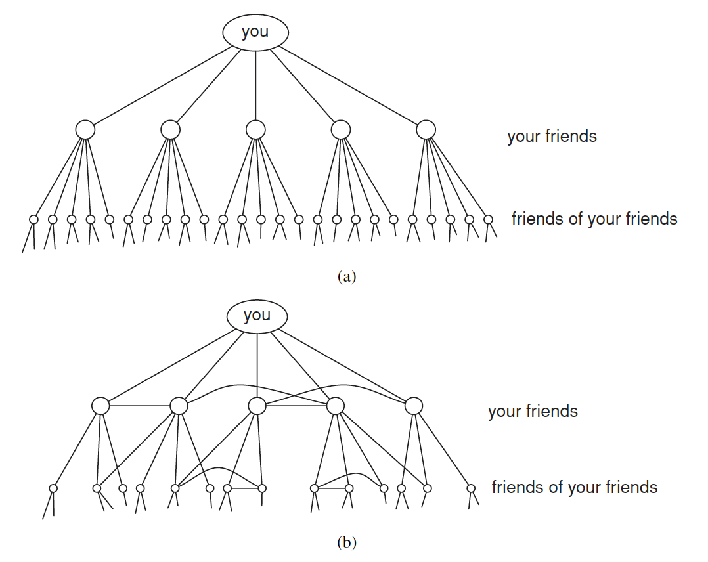
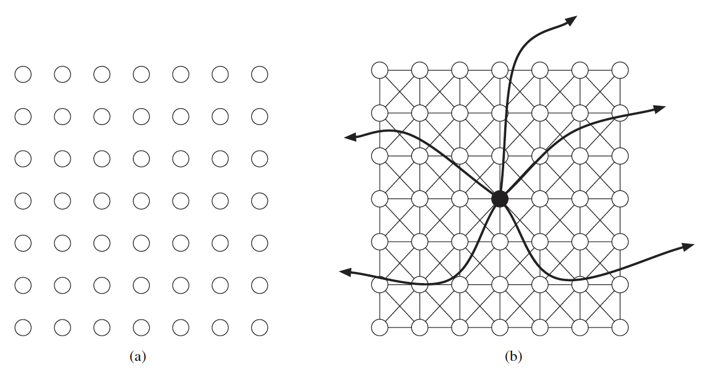
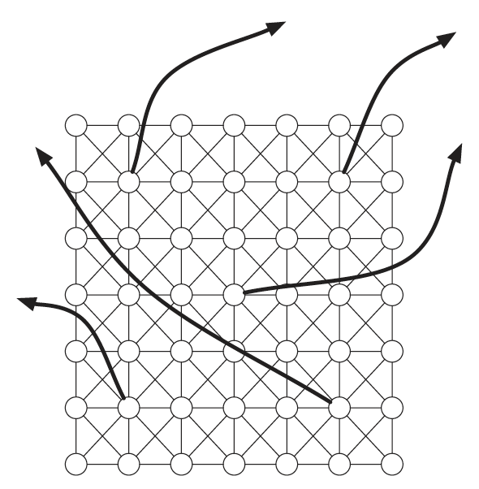
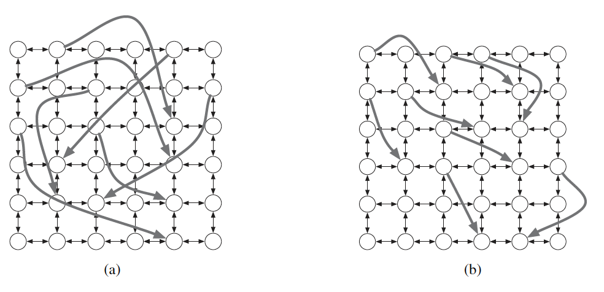
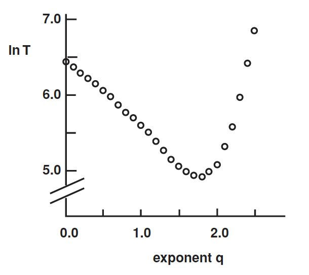
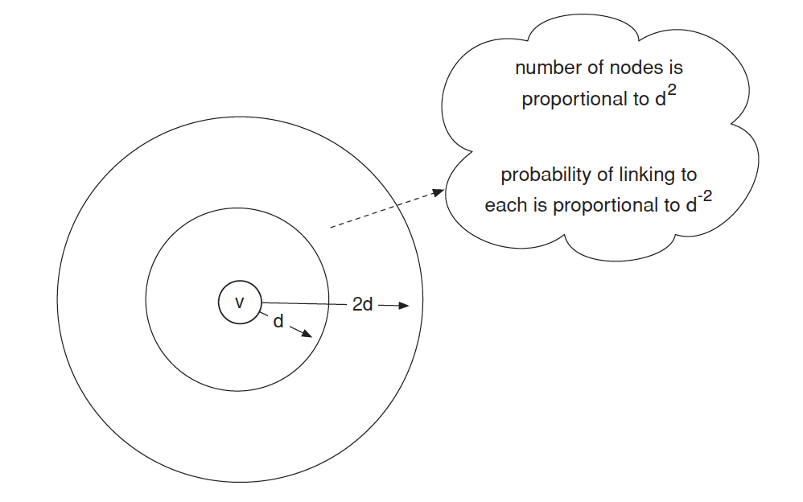

>「哈囉！我也是某某某的朋友ㄟ！」

如果你跟一個社交能手出門，上面這句話肯定是這趟路途中除了你們的對話之外，最常聽到的一句話了。你可否想過，可能你的朋友看似只有幾個，但在某些場合上卻驚人的發現他們彼此居然有共同朋友，甚至是直接認識，這到底是什麼原因呢？背後的邏輯又是什麼？

## 小世界理論、六度分隔理論

「小世界理論」(the small world phenomenon)是由社會學家兼數學家 Stanley Milgram 在 1967 年提出的一個概念，用於描述社群網絡中的連接性和資訊流動。Milgram 指出即使在人與人之間存在很遠的社交距離，兩個人之間的聯繫也可以通過短暫的**中間人**連接起來。換句話說，世界上的每個人都可以通過有限的中間人與任何其他人相連。

### 小世界理論對社群網絡的解釋

根據小世界理論，社群網絡通常具有以下特點：

- 社群網絡具有高度的聚集性：人們往往傾向於形成小圈子或社區，其中彼此之間的聯繫更加緊密。這種聚集性使得社群網絡具有高度的社交結構和區域性。

- 社群網絡具有短平均路徑：即使在一個大型的社群網絡中，任意兩個人之間的平均距離也相對較短。這是由於存在許多短暫的中間人，使得資訊或影響可以很快地在社群網絡中傳播。

- 六度分隔理論：小世界理論的一個重要觀點是「六度分隔」，即認為任意兩個人之間的平均社交距離不超過六個人。換句話說，我們通過至多六個中間人可以與世界上的任何一個人建立聯繫。

這些特點對於理解資訊傳播、社交影響和社會動態等方面具有重要意義。小世界理論的應用領域包括社群網絡分析、病毒傳播模型、網絡推廣和社交媒體研究等。通過研究社群網絡的結構和動態，我們可以更好地理解人類社會的組織和互動方式。

### 六度分隔理論

Milgram 最著名的實驗之一就是六度分隔理論。在這個實驗中，他選擇了幾十個隨機選定的人作為起點，要求他們將一封信通過自己的社交連接傳遞給一個目標人物，並觀察信件傳遞的步數。實驗結果顯示，平均而言，信件只需要經過大約六個人的傳遞就可以到達目標人物。

六度分隔理論的核心概念是「六個中間人」，也稱為「六步法則」。這指的是，通過人與人之間的連結網絡，任何一個人可以通過與不超過六個中間人建立聯繫，與地球上任何其他人相關聯。換句話說，人與人之間的社交距離通常比我們想像的要短得多，該理論也揭示了人與人之間的聯繫和相互影響的深度和廣度。

  

假設我們每個人都認識超過 $100$ 個朋友。每個朋友除了你之外至少還有 $100$ 個朋友，理論上你可能與 $100 \times 100 = 10,000$ 個人相差兩步。考慮到這些人的 $100$ 個朋友，理論上我們可能與 $100\times 100 \times 1000 = 1,000,000$ 個人相差三步。可以得見每一步都以 $100$ 的幂次增長，即 $100^n$。

## Watts-Strogatz 模型[^1]

[^1]:Watts–Strogatz model - Wikipedia. (2018, May 18). Watts–Strogatz Model - Wikipedia. [https://en.wikipedia.org/wiki/Watts-Strogatz_model](https://en.wikipedia.org/wiki/Watts-Strogatz_model)

Watts-Strogatz 模型基於以下兩個重要概念：「規則網絡」和「隨機重連」。

- 規則網絡：規則網絡是一種具有高度規則結構的網絡，其中每個節點與其鄰近節點直接連接。在規則網絡中，距離較遠的節點之間需要經過多個中間節點才能建立連接。

- 隨機重連：隨機重連是指在規則網絡中，隨機地斷開某些連接並隨機地建立新的連接。這種隨機性重組的過程為網絡帶來了一定的隨機性和無序性。

### 網絡圖建構之演算法

給定所需的節點數目 $N$、平均度數 K（假設為偶數整數）和參數 $\beta$，滿足 $0 \leq \beta \leq 1$ 和 $N >> K >> ln N >> 1$，該模型以以下方式構建具有 $N$ 個節點和 $N \times \frac{K}{2}$ 條邊的無向圖：

- 建立一個規則環狀格，一個具有 $N$ 個節點的圖，每個節點與 $K/2$ 個鄰居節點相連接，其中 $K/2$ 個位於左側，$K/2$ 個位於右側。也就是說，如果節點被標記為 $0, 1, \cdots, N-1$，則只有當 $0 < |i-j|\mod (N-1-\frac{K}{2}) ≤ \frac{K}{2}$ 時，節點 $i$ 和 $j$ 之間存在一條邊。

- 對於每個節點 $i = 0, 1, \cdots, N-1$，選取與其右側 $K/2$ 個最近鄰節點相連接的所有邊，也就是所有 ($i, j \mod N$) 滿足 $i < j ≤ i+\frac{K}{2}$ 的邊，並以機率 $\beta$ 進行重連結。重連結的方式是用隨機選取的節點 $k$ 取代 ($i, j \mod N$) 中的 ($i, j$)，節點 $k$ 從所有可能的節點中均勻隨機選擇，但要避免自環（即 $k \neq i$）和重複連接（此時算法中不存在 ($i, k'$) 中的 ($i, k'$) 滿足 $k' = k$）。

透過這樣的方法，可以建立一個具有小世界特性的網絡結構，同時具有規則性和隨機性的特點。該模型的研究有助於我們對小世界網絡的理解，並提供了一個重要的工具來研究網絡的結構和動態行為。

  

### 性質

該模型的基本格點結構產生了具有局部聚集特性的網絡，而隨機重連結的邊則顯著降低了平均路徑長度。該算法引入了約 $\beta \frac{NK}{2}$ 條這樣的非格點邊。通過改變 $\beta$，可以在規則格點結構（$\beta=0$）和接近 Erdős-Rényi 隨機圖結構（$p=\frac{K}{N-1}$）的結構之間進行插值，但並不實際收斂到 Erdős-Rényi 模型。這是因為每個節點至少與 $K/2$ 個其他節點相連接。

- 平均路徑長度：對於環狀格點結構，平均路徑長度約為 $\frac{N}{2K}$，隨著系統大小呈線性增長。當 $\beta$ 接近 $1$ 時，該圖趨近於一個具有 $\frac{\ln N}{\ln K}$ 平均路徑長度的隨機圖，但並未實際收斂到該值。在 $0 < \beta < 1$ 的中間區域，平均路徑長度隨著 $\beta$ 的增加迅速下降，快速接近其極限值。

- 群聚係數：對於環狀格點結構，群聚係數約為 $\frac{3(K-2)}{4(K-1)}$，當 $K$ 增大時趨於 $3/4$，與系統大小無關。當 $\beta$ 接近 $1$ 時，群聚係數與經典隨機圖的群聚係數（$C = \frac{K}{N-1}$）具有相同的量級，因此與系統大小成反比。在中間區域，群聚係數保持接近於規則格點結構的值，在相對較高的 $\beta$ 值下才會下降。這解釋了「小世界」現象，即平均路徑長度快速下降而群聚係數不變。

- 度數分佈：
在環狀格點結構下，度數分佈只是以 $K$ 為中心的一個 Dirac Delta 函數。對於大量節點和 $0 < \beta < 1$，度數分佈可以表示為

$$
{\mathbb{P}(k)\approx \sum _{n=0}^{f(k,K)}{{K/2} \choose {n}}(1-\beta )^{n}\beta ^{K/2-n}{\frac {(\beta K/2)^{k-K/2-n}}{(k-K/2-n)!}}e^{-\beta K/2},}
$$

度數分佈的形狀類似於隨機圖的形狀，在 $K$ 值處有明顯的峰值，並在大的 $|k-K|$ 值處呈指數衰減。網絡的拓撲結構相對均勻，即所有節點的度數相似。

  

  

### 小結

Watts-Strogatz 模型的主要發現是：即使在極端的規則性和隨機性之間，網絡仍具有小世界特性。這代表在大多數情況下，任兩個節點之間的最短路徑長度相對較短，通常小於總節點數的對數級別。這解釋了為什麼在現實生活中，人們之間的聯繫看似遙遠，但實際上通過有限步數就能建立起來。

## 分散式搜索

現在考慮 Milgram 小世界實驗的第二個內容，也就是人們實際上能夠共同找到通往指定目標的短路徑。即使我們假設社交網絡包含短路徑，為什麼它會被結構化成使得這種分散式搜索如此有效呢？顯然，該網絡包含某種梯度(gradient)，幫助參與者將信息引導到目標。

從 Watts-Strogatz 模型出發，假設一個起始節點 $s$ 收到一個必須轉發到目標節點 $t$ 的信息，通過網絡的邊傳遞該信息。起初，$s$ 只知道 $t$ 在網格上的位置，但關鍵是它不知道除了自己以外的任何節點的隨機邊。我們將根據它們的傳遞時間（到達目標所需的預期步驟數）來評估不同的搜索程序，使用隨機生成的長距離接觸集合和隨機選擇的起始和目標節點。

不幸的是，在上述假設下，可以證明 Watts-Strogatz 模型中的分散式搜索將需要大量的步驟才能到達目標，遠遠超過最短路徑的實際長度。問題在於，在這個模型中，使世界變小的弱連接「太隨機」：因為它們與同質性的節點相似性完全無關，所以我們很難可靠地使用這些節點。

### 分散式搜索之模型化

Watts-Strogatz 模型的一個輕微概括展示了我們想要的兩個特性：網絡包含短路徑，並且可以使用分散式搜索找到這些短路徑。我們通過引入一個額外的量化方法調節長距離弱連接所涵蓋的範圍來適應該模型。

每個 $k$ 個隨機邊的生成方式隨著距離的增加而衰減，由群聚係數 $q$ 控制。對於兩個節點 $v$ 和 $w$，令 $d(v,w)$ 表示它們之間的網格步數。在生成從 $v$ 出去的隨機邊時，該邊與 $w$ 建立連接的機率與 $d(v,w)^{-q}$成比例。

原始的模型對應於 $q = 0$，因為此時的連接是均勻隨機選擇的。變化 $q$ 就像調節一個控制隨機連接均勻性的旋鈕。

- 當 $q$ 非常小的時候，長距離連接是「太隨機」的。
- 當 $q$ 很大時，長距離連接則「不夠隨機」。

當群聚係數很小時，隨機邊往往跨越網格的長距離；隨著群聚係數的增加，隨機邊變得更短。

  

### 模擬分散式搜索

在具有群聚係數 $q$ 的模型中進行分散式搜索的模擬。每個點是對 $400$ 萬個節點的網格的 $1000$ 次運行的平均值。如我們所預期的，傳遞時間在群聚係數$q = 2$ 附近最佳；但即使對於這麼多節點，傳遞時間在$1.5$ 到 $2$ 之間的範圍內也是可比較的。

  

### 一般化模型

即使沒有完整的證明細節，有一個簡短的計算可以解釋為什麼數字 $2$ 很重要。

在進行 Milgram 實驗的真實世界中，我們在心理上將距離分為不同的分辨率：可以是環遊世界、跨越國家、跨越州、跨越城鎮或者是街區之間。有效的分散式搜索通過這些不同的分辨率將搜索集中起來，就像我們從這個圖中看到的信件在每一步中將與目標的距離減少大約一半的方式一樣。

  

由於平面上的面積隨著半徑的平方增長，這個群組中的總節點數與 $d^2$ 成比例。另一方面，節點 $v$ 與群組中任何一個節點相連的機率取決於它們之間的距離，但每個個體的機率與 $d^{-2}$ 成比例。群集中的節點數量和連接到其中任一節點的機率大致上相互抵消。隨機邊連接到這個圓環中的某個節點的機率，大致上與 $d$ 的值無關。

這表明了當 $q = 2$ 時網絡產生的一種定性思考方式：長距離的弱連接以一種大致均勻分布在所有不同的分辨率尺度上的方式形成。這使得轉發資訊的人能夠始終找到減少與目標距離的方法，無論他們離目標有多遠。引導資訊通過反平方網絡的相應模式是從完全隨機的連接模式中自發產生的。

