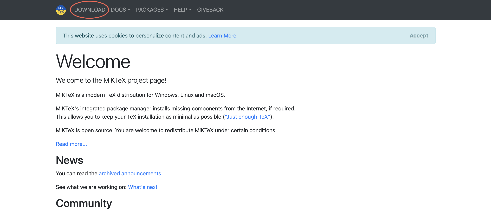
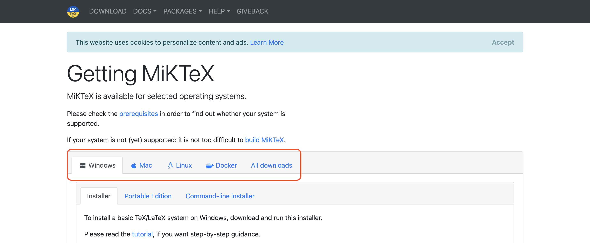
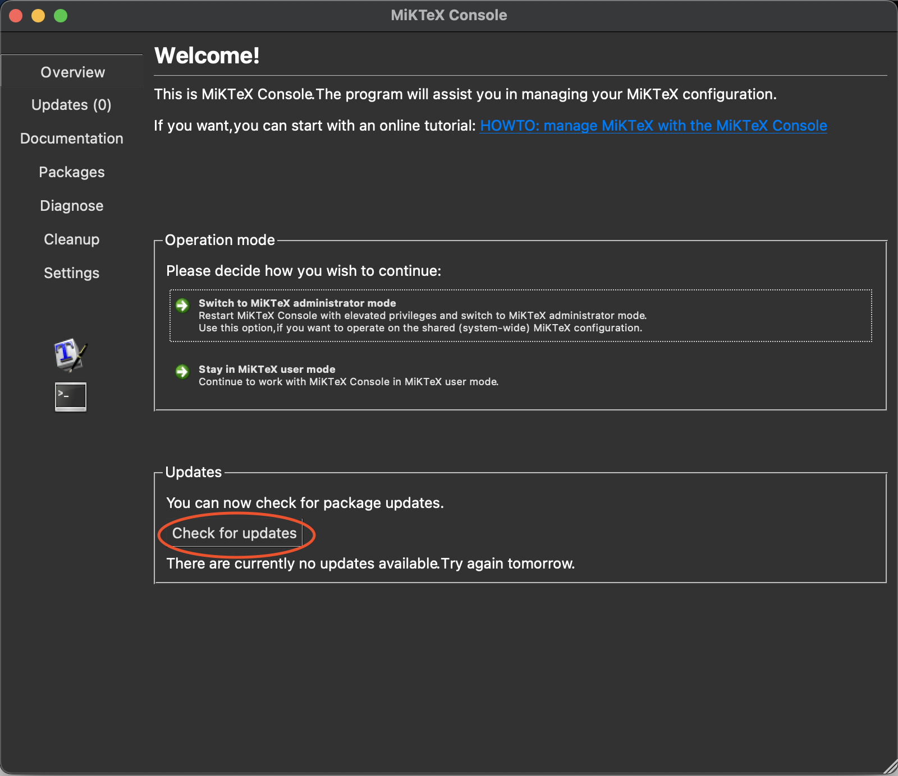
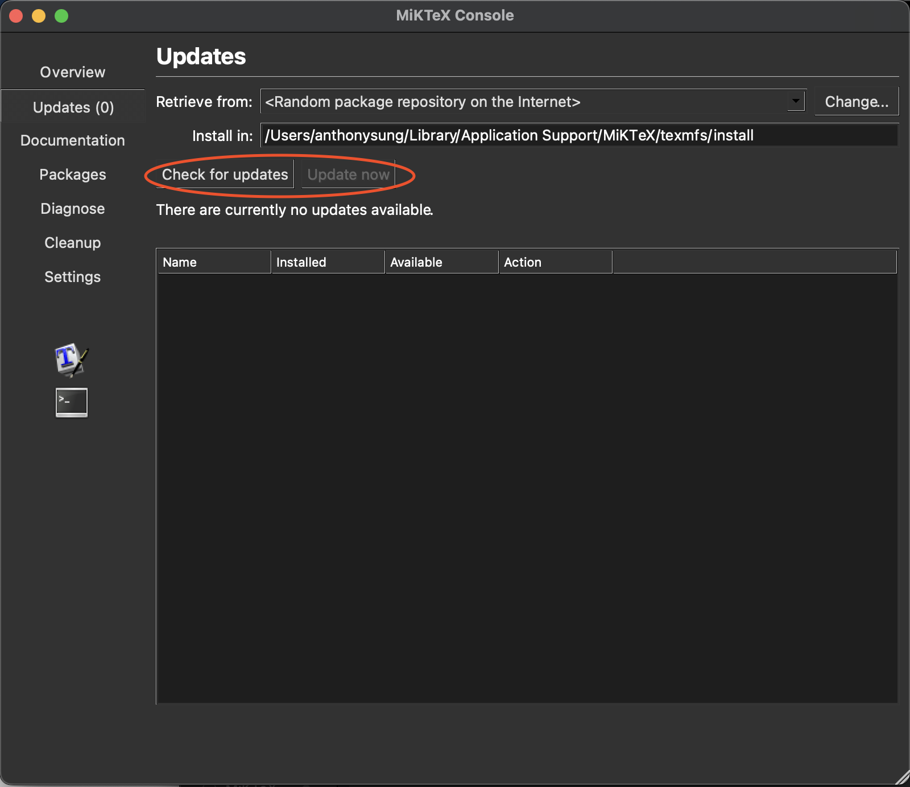
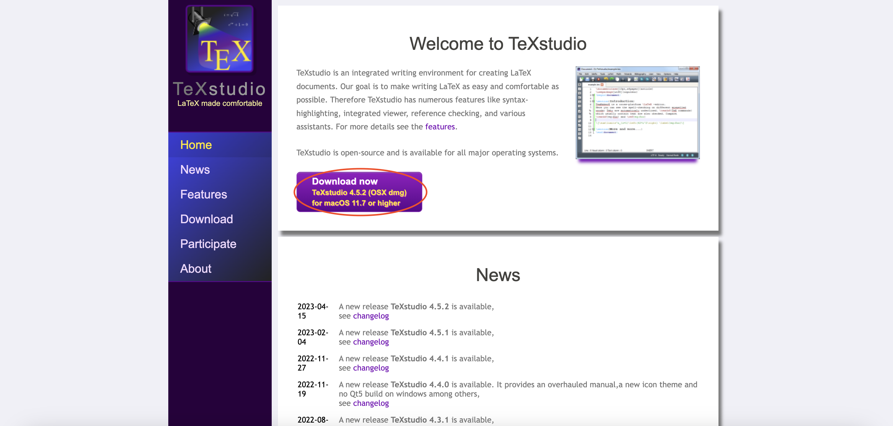

$\LaTeX$ 是一個基於 $\TeX$ 的排版系統，由美國電腦科學家 Leslie Lamport開發，遵循呈現與內容分離的設計理念，讓使用者能夠在撰文時致力於寫作，而非同時兼顧版面與內文[^1]。Word 與 $\LaTeX$ 最大的不同之處在於，Word 最強大的功能「所得即所見」是勝過後者的優勢，初學者可以無師自通，後者則是需要學習指令，Word 的這個特點就完全贏過後者。然而，$\LaTeX$ 的特點即是「呈現與內容分離」，使用者可以專注於撰文，而不用同時注意內文與版面。因此，許多 $\LaTeX$  的使用者仍會透過Word先進行「前端設計」，再交由 $\LaTeX$ 進行版面設定與產出。這個系列的內容係參考自李果正的[《大家來學$\LaTeX$》](https://jupiter.math.nctu.edu.tw/~smchang/latex/latex123.pdf)與吳聰敏老師的[《cw$\TeX$ 排版系統》](https://www.math.sinica.edu.tw/www/tex/cxbook3.pdf)。

[^1]:"Latex." Wikipedia, Wikimedia Foundation, 12 June 2021, [zh.wikipedia.org/zh-tw/LaTeX](zh.wikipedia.org/zh-tw/LaTeX).

## 編輯及編譯系統安裝

$\LaTeX$ 有許多不同種類的編譯與編輯器組合，本文將以作者最常見的組合 MiKTeX 搭配 TeXStudio 介紹。當然如果有特別的偏好也無妨，只要能夠編輯即可。


### MikTeX 安裝

首先點擊[這裡]()進入 MiKTeX 官網。



接著點擊 `Download` 按鈕， 進入頁面後根據電腦的作業系統選擇安裝檔。



下載並安裝後便可以進行更新。


按下之後即可更新 MiKTeX。更新完畢後點選左側的 `Updates` 按鈕進入更新區，依序按下 `Check for updates` 以及 `Update now` 後即完成。



### 安裝 TeXStudio

請點擊[這裡](https://www.texstudio.org/)進入 TeXStudio 官網後，按下下載按鈕即可安裝。安裝完成後基本上就可以開始編譯了。


如果要更改編譯器，請到依照以下步驟更改。

- macOS 系統：點選左上角 `TeXStudio` $\rightarrow$ 點選 `Preferences` $\rightarrow$ 點選 `Build` $\rightarrow$ 將 Default Compiler 改為你想要的編譯器。
- macOS 系統：點選左上角 `TeXStudio` $\rightarrow$ 點選 `Options` $\rightarrow$ 點選 `Build` $\rightarrow$ 將 Default Compiler 改為你想要的編譯器。

以上就是安裝 MiKTeX 與 TeXStudio 的過程。

## 第一份 $\LaTeX$ 文件

### 簡單實例操作

先來試試看，這裡先使用 report 類別文稿，因為 article 類別文稿是沒有chapter 的

```{tex}
\documentclass{report}
\begin{document}
This is my first {\LaTeX} typesetting example.\\
This is my first \LaTeX{} typesetting example.\\
This is my first \LaTeX\ typesetting example.\\
I am Mr. Edward G.J. Lee, G.J. is a abbreviation of my name.\\
I am Mr.\ Edward G.J. Lee, G.J. is a abbreviation of my name.\\
Please see Appendix A. We will be there soon.\\
Please see Appendix A\null. We will be there soon.
\end{document}
```

排版結果如下：


#### 關於縮排

我們可以看到第一行縮排了，因為沒有分章節便將換行前的內容做為引言，故會縮排。要解決問題有兩種方法：

* 第一行加入`\noindent`來指示 $\LaTeX$ 不要縮排。但這種作法仍僅限於下指令之處，其他該縮排的地方仍會縮排。
* 在 preamble 區加入`\parindent=0pt`，表示讓全文的縮排為0pt，當然這就表示全文都不要縮排了。


#### 加入章節標題

在 $\LaTeX$ 中加入章節標題可以不用理會字體大小，只需下指令即可。以下仍用 report 類別說明。注意到，$\LaTeX$ 對於章節標題的預設數字都是阿拉伯數字，若要自行改成中文標題，可以在大括號前加上星號(`*`)，就可以自行替換了，例如`\section{}`、`\section*{}`。

#### 加入標題頁資訊

這是指內頁的第一頁，我也不知道這個中文專有名詞是什麼，在 $\LaTeX$ 裡頭，我們就稱為 title page。在 $\LaTeX$ 的標準格式裡，他包括了標題(title)、作者名字(author)、日期(date) 及感謝詞(thanks)。

```tex
\documentclass{report}
\title{Report File}
\author{Noname\thanks{Thanks to the readers.}}
\date{\today}
\begin{document}
\maketitle

This is the first sentence in my \LaTeX\ file.

\chapter{First Chapter}
\section{Section}
...
\end{document}
```

加入標題頁資訊後，必須在`\begin{document}`與`\end{document}`之間加入`\maketitle`，才能將剛剛的資訊在文件中顯示。

#### 加入目錄

加入目錄(Table of Contents) 對 $\LaTeX$ 而言，更是輕而易舉的事情，只要在本文開頭加個`\tableofcontents`指令就成了。

#### 加入摘要

如果要加入的話，可使用 abstract 環境，即

```tex
\begin{abstract}

\end{abstract}
```

在這個環境中的文章，左右會縮排。要注意的是，只有 article/report 類別才有 abstract，book 類別不能使用這個環境。report 類別的摘要自成一頁，不編頁碼，且不會編入目錄中，這和一般的論文格式可能會不一樣，使用時請注意。article 的類別則仍然是和本文相連的，會出現在文章標題之後。

#### 加入註解

在 $\LaTeX$ 裡頭，註解可有兩種方式，一種是**腳註(footnote)**，一種是**邊註(marginal note)**。通常 $\LaTeX$ 的腳註預設是由阿拉伯數字在編號，置於頁底部。在沒有部(part)的情形下，report/book 類別，編號每章會從頭起算，article 類別則會連續，而且會使用`footnotesize`的字體印出。邊註則不編號，字體是正常大小。

- 腳註：只要在要加入腳註的後面加上`\footnote{}`即可。
- 邊註：如果要使用邊註，首先必須在前言區引用`marginnote`這個套件，接著便可以在文件中加入邊註。

```{tex}
\documentclass[a4paper,twoside,english]{article}
\title{Test}
\author{Noname}
\usepackage{lipsum}
\usepackage{marginnote}
\makeatother

\begin{document}
\maketitle
\section{Margin notes}

\marginnote{First margin note.}[0cm]
\marginnote{Second margin note.}[3cm]
\lipsum[1-2]\footnote{Footnote is right here.}
\end{document}
```

### 字體大小與字形的調整

假設我們在文稿內想要將某些文字放大，有以下兩種方式：使用 $\LaTeX$ 中預設調整字體大小的方式；另一種則是使用`\selectfont{}`將文字有彈性地調整至使用者想要的大小。不過，在討論字體大小調整之前，我們先來看一些簡單的設定，也就是如何將文字變成粗體、斜體、粗斜體

#### 字形的調整


|指令 |結果|
|---|---|
|`\textit{italic}`| $\textit{italic}$|
|`\textbf{boldface}` |**boldface**|
|`\textsf{sans serif}` |$\textsf{sans serif}$|
|`\textrm{roman}` |$\textrm{roman}$|
|`\texttt{typewriter}`| $\texttt{typewriter}$|

#### 字體大小

系統預設調整字體大小的方式可以參考下列表格，右邊是對應的字級：


| 指令 | 實際大小 |
| -------- | -------- | 
| `\tiny`     | 5pt     |
| `\scriptsize`     | 7pt     |
| `\footnotesize`     | 8pt     |
| `\small`     | 9pt     |
| `\normalsize`     | 10pt     |
| `\large`     | 12pt     |
| `\Large`     | 14.4pt     |
| `\LARGE`     | 17.28pt     |
| `\huge`     | 20.74pt     |
| `\Huge`     | 24.88pt     |

另一個方式則是使用`{\fontsize{字級}{行基線間距}\selectfont Hello}`

```{tex}
\documentclass[12pt]{article}
\usepackage{anyfontsize}
\makeatother

\begin{document}
{\fontsize{150}{60}\selectfont Hello}{\fontsize{15}{6}\selectfont Hello}
\end{document}
```

### 使用中文

$\TeX$ 的開發者 Knuth 教授當初並未料想到會有中文使用者欲進行排版，因此若我們想要在文件中顯示中文，則必須向 $\LaTeX$ 宣告中文套件，才能在文稿內使用中文。注意到 $\TeX$ 的編輯系統`pdfLaTeX`、`XeLaTeX`與`LuaLaTeX`在支援中文字體上有不一樣的程度：`pdfLaTeX` 是完全不支援；後兩者則是支援`UTF-8`。以下就分別以支援與不支援`UTF-8`的情況做說明。

#### 不支援 UTF-8

在不支援 UTF-8 的情況下，我們要引用`CJKutf8`套件，並參考以下程式碼：

```tex
\documentclass[12pt]{article}
\usepackage{CJKutf8}
\begin{document}
\begin{CJK*}{UTF8}{中文字體}
\section{大綱}
這裡是大綱，也可輸入英文\\
You can also type english here.
\section{先備知識}
這裡是先備知識
\end{CJK*}
\end{document}
```

#### 支援 UTF-8

如果在 xeLaTeX 或 LuaLaTeX 的環境下，我們則使用`xeCJK`這個套件，並參考以下程式碼：

```{tex}
\documentclass[12pt]{article}
\usepackage{xeCJK}
\setCJKmainfont{標楷體}
\begin{document}
\section{第一章}
認識\LaTeX\
\section{第二章}
了解如何使用中文排版
\end{document}
```

前面展示了如何使用引用中文的巨集套件。不過，在撰文時可能會需要使用不同字體，比如標題規定要使用標楷體，內文要使用新細明體，$\LaTeX$ 可以針對電腦已安裝的字體搜尋其路徑，最後進行編譯。

```{tex}
\documentclass[12pt]{article}
\usepackage{xeCJK}
\setCJKmainfont{標楷體}
\setCJKfamilyfont{QHei}{cwTeXQHei-Bold} %宣告抓取該字體
\newcommand*{\QH}{\CJKfamily{QHei}} %設定該字體命令
\begin{document}
...
\end{document}
```

最後，必須注意，這些字體都必須是已經安裝在讀者端的電腦上，如果想要下載由吳聰敏老師開發的`cwTeX`系列字體，可以參考[這篇文章](https://github.com/l10n-tw/cwtex-q-fonts)。