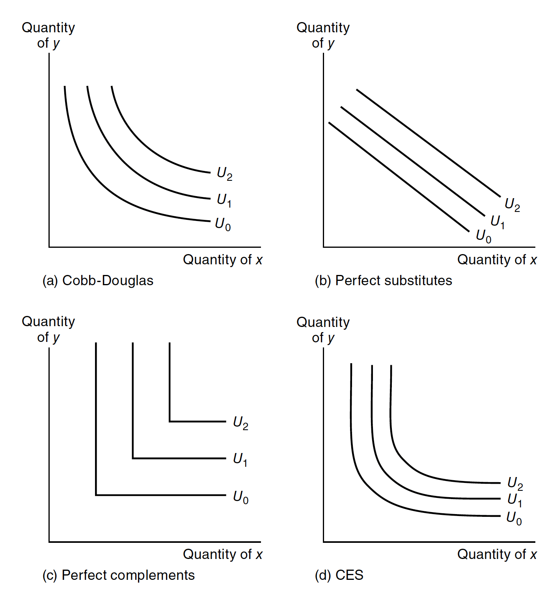
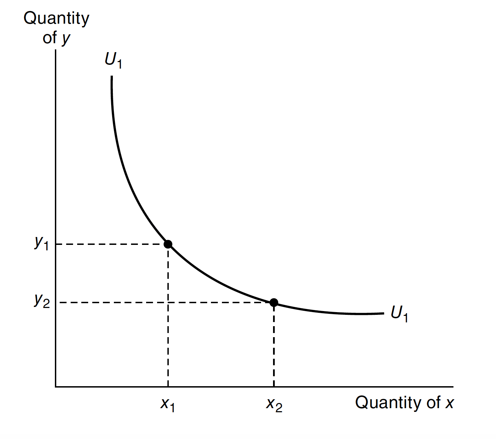
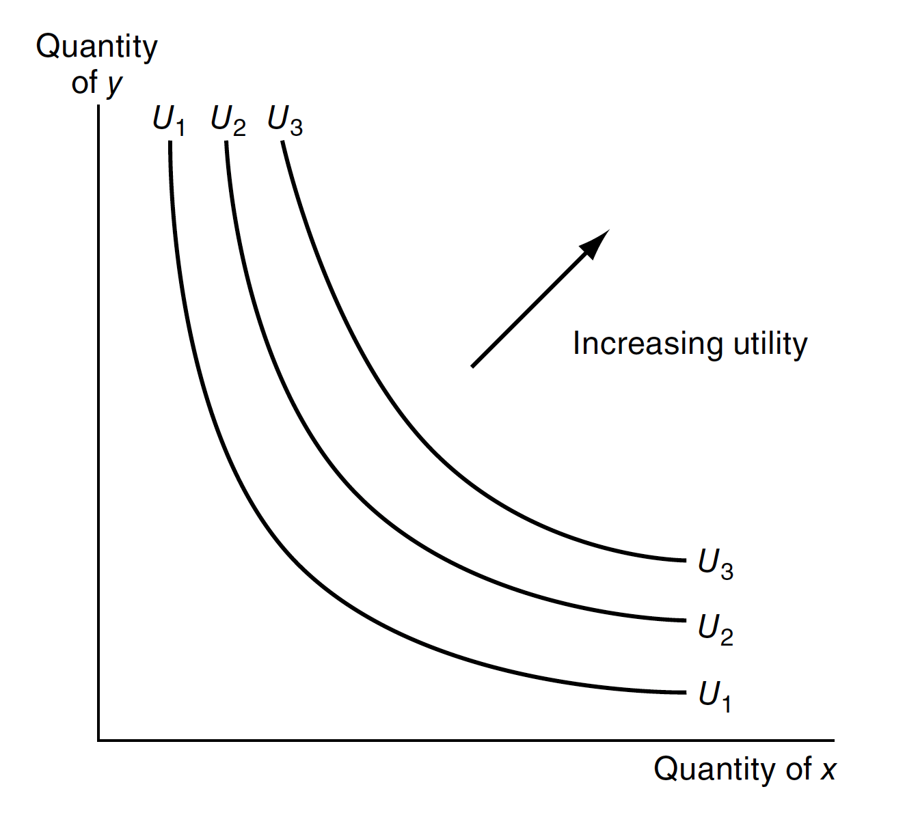
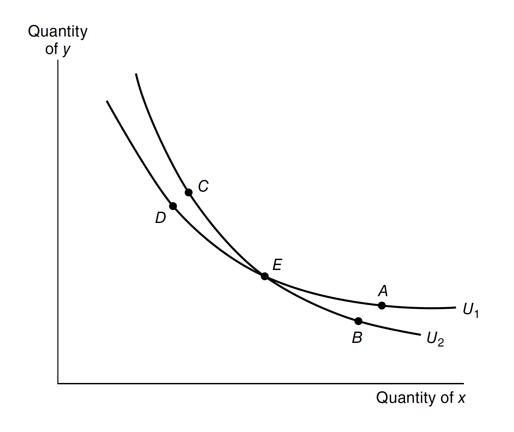
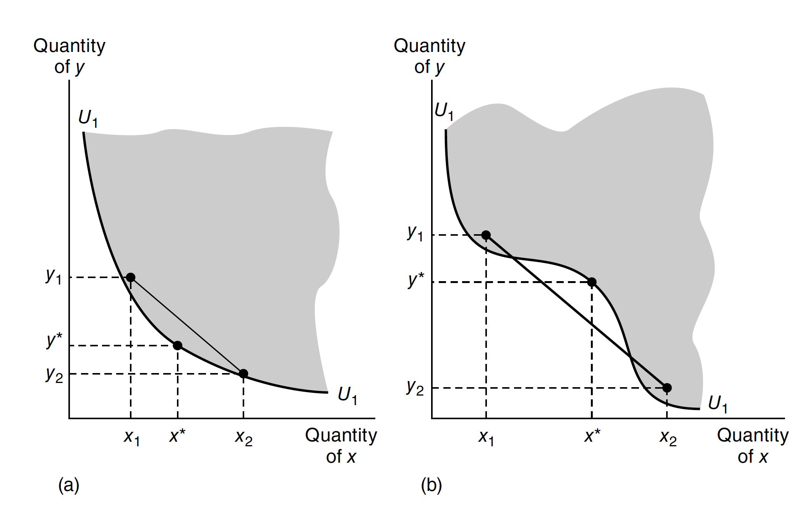
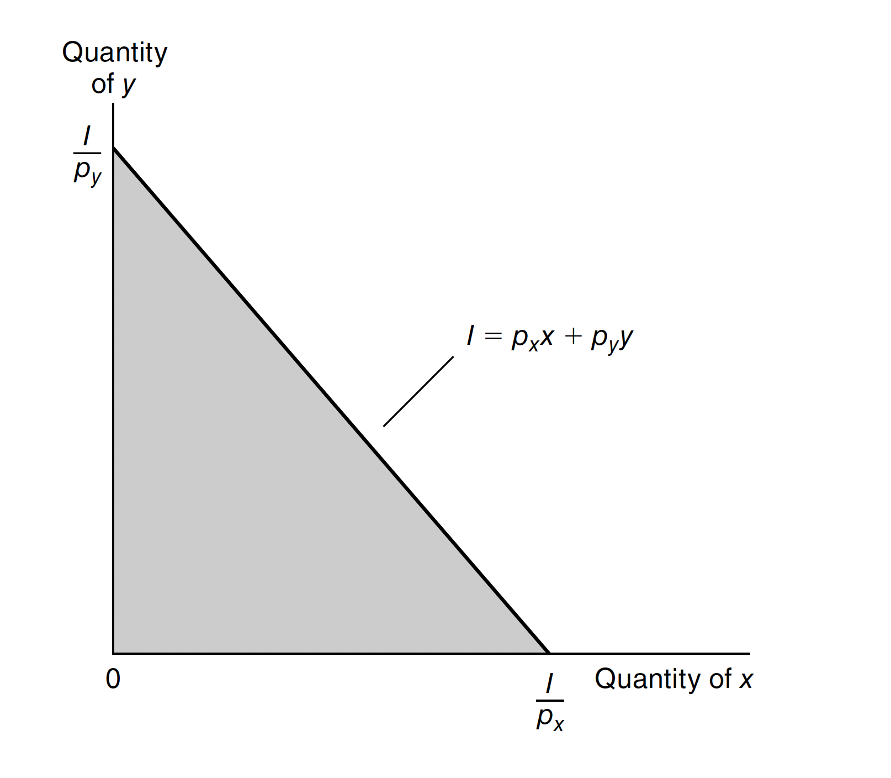
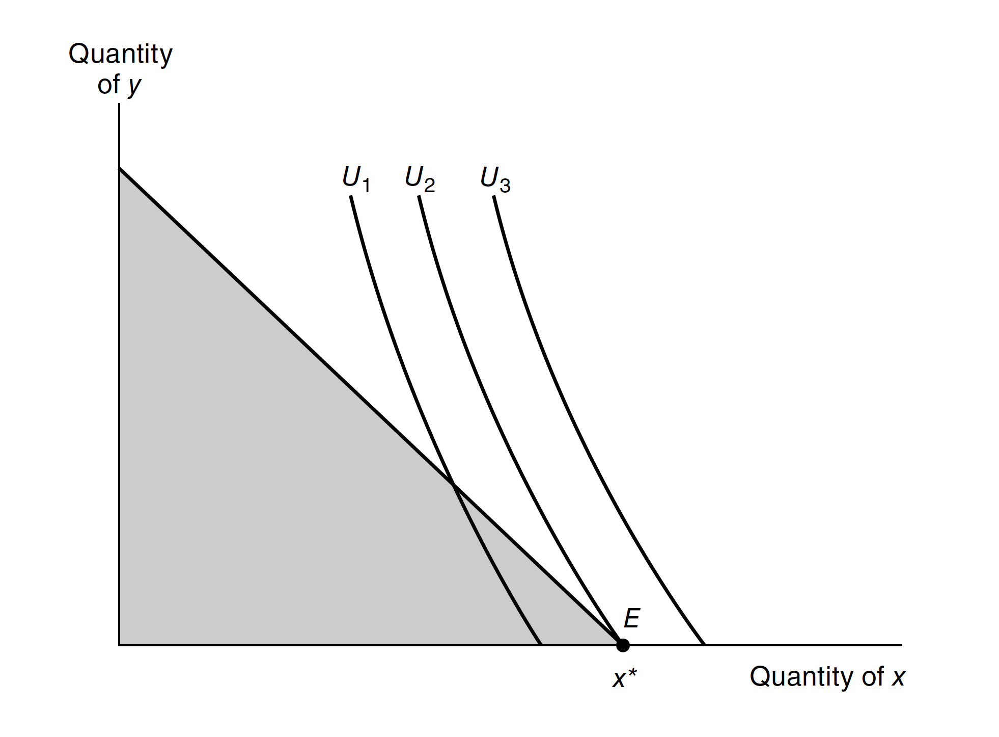

An economy consists of consumers with *preferences* and *endowments*, firms with *technology*. However, in an economy, all these resources are limited, which yields the agents in an economy make choices based on constraints. Therefore, in this section, we will discuss how a *rational* consumer make choice by *maximizing* his or her *utility* given a *budget constraint set*, which is called *partial equilibrium*. 

## Consumption Set

Let $X$ denote a consumer's consumption set, and $x, y \in X$ denote potential consumption bundles. We can write $x = (x_{1}, x_{2}, \cdots, x_{n})$, where $n$ is the number of goods and $x_{k}$ denotes the quantity of good $k$ in the consumer's consumption bundle. Also, we may use subscript $i$ to index each consumer $i$'s consumption set $X_{i}$ and bundle $x_{i} = (x_{i1}, x_{i2}, \cdots, x_{in})$. But here we drop the index $i$ for simplicity. Here we should note that, even though we have mentioned "goods" in the previous text, each good can also represent a location, time, state of the world, etc.

### Consumer Preferences

A preference relation is an ordering over the elements of $X$, which represents the "preferences" of each individual in an economy. Here are some notations we will use in economic analysis:

- $x \succsim y$: $x$ is at least as good as $y$
- $x \succ y$: $x$ is better than $y$
- $x \sim y$: $x$ is as the same as $y$, i.e., $x \succsim y$ and $y \succsim x$

### Rational Choice

In economics, "rational" means that those preferences are complete, transitive, and continuous.

- $\textbf{Completeness}$: If $x$ and $y$ are any two consumption possibilities, the consumer can always specify exactly one of the following possibilities: $x \succ y$, $y \succ x$ or $x \sim y$. The intuition is that any alternative can be compared and be ranked.
- $\textbf{Transitivity}$: If any consumer reports that $x \succeq y$ and $y \succeq z$m then he or she must also report that $x \succeq z$. That is, choices must be internally consistent.
- $\textbf{Continuity}$: If a consumer reports that $x \succ y$, then he or she must also report that $x' \succ y$ for any $x'$ "close to" $x$.

### Utility Function

With the underlying preference ordering, we can discuss the utility function of an individual. A utility function $u: X \to \mathbb{R}$ represents $\succsim$ if and only if for all $x, y \in X$,
$$
x \succsim y \Longleftrightarrow u(x) \geq u(y)
$$

The function is unique only up to an order-preserving transformation.

$\textbf{Theorem 1.1}$ Any preference relation that can be represented by a continuous utility function is rational. To be more specific, only rational preferences relations can be represented by a utility function; conversely, if $X$ is finite, any rational preference relation can be represented by a utility function.

$\textit{proof.}$ Since $\mathbb{R}$ is an ordered field, we follows from completeness, transitivity and continuity of $\geq$ on $\mathbb{R}$ then we know that a continuous utility function is rational.

<!--Lexicographic preference is an counterexample of $\textbf{Theorem 1.1}$. The preference relation $\succsim_{L}$ on $[0, 1] \times [0, 1]$, which is induced from the relations $x \succsim y$ if $x_{k} \geq y_{k},  \; \forall k = 1, 2$, does not have a utility representation.-->

Here are some common utility functions corresponding to the diagram below:

- Cobb-Douglas utility:
$$
U(X,Y) = X^{\alpha}Y^{\beta}
$$
- Perfect complements:
$$
U(X,Y) = \min \{\alpha X,\beta Y\}
$$
- Perfect substitutes:
$$
U(X,Y) = \alpha X + \beta Y
$$
- CES utility:
$$
U(X,Y) = \frac{X^{\delta}}{\delta} + \frac{Y^{\delta}}{\delta}
$$

{fig-align="center" width=55%}

*Local non-satiation* is another property of utility function.

$\textbf{Property 1.1}$ For every $x \in X$ and every $\varepsilon > 0$, there exists $y \in X$ such that $\lVert y - x \lVert < \varepsilon$ and $y \succ x$.

{fig-align="center" width=55%}

It says that if given an $x$ in the consumption set and an arbitrary small number, there exists some other element $y$ in the consumption set, so that when we construct a neighborhood of $x$, i.e., $B_{\varepsilon}(x)$, within this neighborhood we find this $y$ which is preferred to $x$. To put it simply, an agent can "never be satisfied" because no matter what bundle of goods they have $x$ there is always a $y$ that yields greater utility, which shows the intuition of "more is always preferred to less".[^1]

[^1]: *Local non-satiation in economics*. (2019, October 18). Economics Stack Exchange. [https://economics.stackexchange.com/questions/32299/local-non-satiation-in-economics](https://economics.stackexchange.com/questions/32299/local-non-satiation-in-economics).

![Fig 1.3: More is always preferred to less[^2]](fig2.png){fig-align="center" width=55%}

[^2]:N. (2007, April 1). *Microeconomic Theory Basic Principles and Extensions*. Thomson. The following graphs come from this book.

### Indifference Curve

The following graph shows the indifference curve of an utility function. The slope of the curve $U_{1}$ represents the rate at which the individual is willing to trade $x$ for $y$ while remaining equally well off, i.e, the *marginal rate of substitution*.

{fig-align="center" width=55%}

- Indifference curves are contour lines. Since the utility is ranking, if we map the utility function to $X-Y$ plane, then utility will be higher with the top-right direction. 

{fig-align="center" width=55%}

- Indifference curves should never intersect. According to the concept of indifference curves, combinations lying on the same curve are considered equally desirable or provide the same level of satisfaction/utility to an individual. This implies that an individual would be indifferent between combinations A and D, as they offer the same level of utility.

However, the axiom of transitivity states that if $A$ is preferred to $B$ and $B$ is preferred to $C$, then $A$ must be preferred to $C$. In this case, if $A$ is preferred to D, and combinations $A$ and $D$ are equally desirable, it would mean that D is also preferred to $A$. This contradicts the assumption that $A$ and $D$ are on the same indifference curve and are equally desirable. Hence, intersecting indifference curves are not consistent with rational preferences.

{fig-align="center" width=55%}

### Marginal Rate of Substitution (MRS)

The negative slope of an indifference curve $U_{1}$ at some point is termed the marginal rate of substitution at that point. That is,
$$
\operatorname{MRS} = - \frac{dY}{dX}\Bigg|_{U = U_{1}}
$$

where the notation indicates that the slope is to be calculated along the $U_{1}$ indifference curve. The MRS tells us the trade-off between good $x$ and $y$ that the consumer will voluntarily make. Therefore, we can make a conclusion that the higher MRS is, the greater the preference for good $x$.

Notice that we typically assume MRS is strictly decreasing. The intuition is "When I have more of $x$, then I'm willing to give up more of $x$ for the same quantity of $y$". This idea implies that indifference curves are strictly convex and that utility functions are strictly quasi-concave. However, MRS doesn't have to be decreasing. If the indifference curve is linear, then the MRS would be constant.

Given a utility function $U(X_{1}, X_{2})$, we can write
$$
\text{marginal utility of }X_{1} = MU_{X} = \frac{\partial U}{\partial X_{1}}
$$
where the marginal utility is the extra utility obtained from slightly more $X_{1}$ while holding the amount of all other goods constant, i.e, *ceteris paribus*.

The total differtial of $U$ can be written as 
$$
dU = MU_{X_{1}}d_{X_{1}} + MU_{X_{2}}d_{X_{2}}
$$
Along any indifference curve, we hold utility fixed, so $dU = 0$. Therefore we can write
$$
\operatorname{MRS} = - \frac{dX_{2}}{dX_{1}}\Bigg|_{U = \text{constant}} = \frac{MU_{X_{1}}}{MU_{X_{2}}}
$$

### Convexity and Quasi-convexity

$\textbf{Definition 1}:$ A set $X$ is *convex* if $x, x' \in X$, then so is $\alpha x + (1 - \alpha)x'$ for each $\alpha$ between $0$ and $1$.

With the definition, a real-valued function $f(x)$ is convex if 
$$
\alpha f(x) + (1 - \alpha)f(x') \geq f\left(\alpha f(x) + (1 - \alpha)f(x')\right)
$$
The set of points on or above the graph of a convex function is convex. The negative of a convex function is said to be *concave*. A function $f(x)$ is *quasi-convex* if
$$
\max\{f(x), f(x')\} \geq f\left(\alpha f(x) + (1 - \alpha)f(x')\right)
$$
for each $\alpha$ between $0$ and $1$.

{fig-align="center" width=75%}

### Homothetic Preferences

*Homothetic preferences* are preferences with marginal rates of substitution which depend only on the ratio of the amounts of the two goods, not on the total quantities of the goods. In such a situation, indifference curves for higher utility are simple copies of those for lower utility. Slope of the curves depend only on the ratio $x_{2}/x_{1}$, not on how far the curve is from the origin.

## Utility Maximization

In the standard economic model, consumer choice is determined by *utility maximization* constrained by a *budget set*. Formally, the optimal consumption choice of a rational price-taking consumer is obtained by solving:
$$
\begin{aligned}
\max_{x_{1}, \cdots, x_{n}}& \; U(x_{1}, \cdots, x_{n})\\
\operatorname{s.t. }&\; p_{1}x_{1} + \cdots + p_{n}x_{n} \leq I
\end{aligned}
$$

where $p_{k}$ denotes the price of good $k$ and $I$ denotes the consumer's income, both denominated in dollars or some unit of account.

If we were to double all prices and income, the budget constraint would remained unchanged. That is, in generally,
$$
p_{1}x_{1} + \cdots + p_{n}x_{n} \leq I
$$
is equivalent to
$$
(tp_{1})x_{1} + \cdots + (tp_{n})x_{n} \leq tI
$$
for any $t > 0$. In other words, individual demand $x(p_{1}, \cdots, p_{n}m I)$ is *homogeneous* of degree zero in all prices and income.

{fig-align="center" width=55%}

Note that the slope of budget constraint, namely $p_{x}/p_{y}$, is said to be the relative price of two goods.

{fig-align="center" width=55%}

### Interior Solution

In fact, utility maximization is an optimization problem with a single equality constraint. We set up Lagrangian[^3]:

[^3]: The Lagrangian method is only applied to interior solutions.

$$
\mathscr{L} = U(x_{1}, x_{2}, \cdots, x_{n}) + \lambda(I - p_{1}x_{1} - p_{2}x_{2} - \cdots - p_{n}x_{n})
$$

The standard first-order conditions for this *interior maximum* are:

$$
\begin{aligned}
& \frac{\partial \mathscr{L}}{\partial x_{k}} = \frac{\partial U}{\partial x_{k}} - \lambda p_{k} \overset{*}{=} 0, \; \forall k\\
& \frac{\partial \mathscr{L}}{\partial \lambda} = I - p_{1}x_{1} - p_{2}x_{2} - \cdots - p_{n}x_{n} \overset{*}{=} 0
\end{aligned}
$$

Note that $\lambda$ can be interpreted as marginal utility of income and is always positive. The first-order conditions imply that
$$
\frac{MU_{i}}{MU_{j}} = \operatorname{MRS} = \frac{p_{i}}{p_{j}}
$$

Intuition behind this equation is that the individual equates the psychic rate of trade-off to the market trade-off.

### Corner Solution

{fig-align="center" width=55%}

In this set of indifference curves representing preferences, utility maximization occurs at point $E$, where the consumption of good $y$ is zero. Due to this unique situation, the first-order conditions for a maximum need to be adjusted accordingly to accommodate this possibility.

If a corner solution is obtained, i.e., $x_{k} = 0$ for some good $k$, then
$$
\frac{\partial U}{\partial x_{k}} - \lambda p_{k} < 0,
$$

which can be rearranged as
$$
p_{k} > \frac{MU_{k}}{\lambda}
$$

This condition can be interpreted as: any good whose price ($p_{k}$) exceeds its marginal value ($MU_{k}/\lambda$) to the consumer will not be purchased.

### Constrained Optimization: General Recipe

Next, we are going to generalize the content mentioned above. Problem statement for optimization with inequality constraints:
$$
\begin{aligned}
& \max_{x} f(x)\\
& \operatorname{s.t. }g_{i}(x) \geq 0 \text{ for }i = 1, \cdots, n
\end{aligned}
$$

To solve the problem, we should follow the steps:

1. Form the Lagrangian:
$$
\mathscr{L} = f(x) + \sum^{n}_{i=1}\lambda_{i}g_{i}(x)
$$
where $f$ and $g_{i}$ are real-valued continuously differentiable functions.

2. Write out the first-order conditions for the $x_{k}$s.
$$
\frac{\partial \mathscr{L}}{\partial x_{k}} = \frac{\partial f}{\partial x_{k}} + \sum^{n}_{i=1}\lambda_{i}\frac{\partial g_{i}}{\partial x_{k}} \overset{*}{=} 0, \; \forall k
$$
3. Write the constraint.
$$
g_{i}(x) \geq 0
$$
4. Write the inequality constraint for the multiplier.
$$
\lambda_{i} \geq 0, \; \forall i
$$
5. Write the complementary slackness condition.
$$
\lambda g_{i}(x) = 0
$$
6. Look for the solution for $x$ and $\lambda$ by combining above equations and inequalities.

Note that the recipe above produces candidates solutions, but does not in general guarantee that the candidate solutions are globally (or even locally) optimal. However, if $f$ is quasi-concave and the constraint set $\{x: g_{i}(x) \geq 0, \; \forall i\}$ is convex, then any solution satisfying the above conditions must be a *global maximier*.